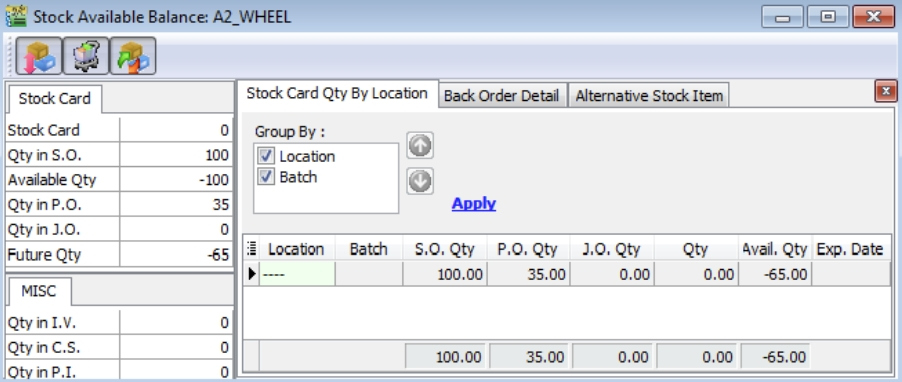
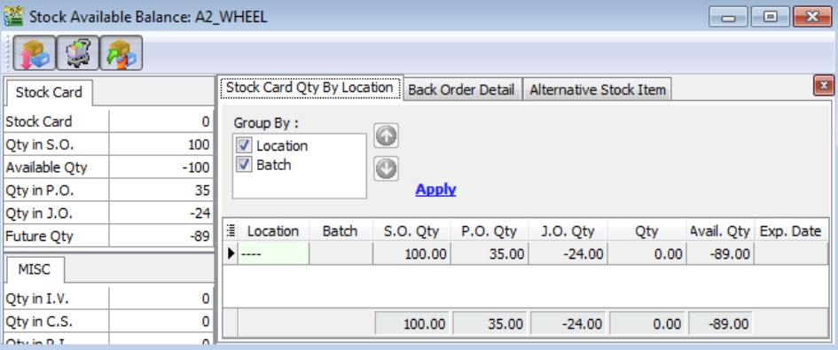
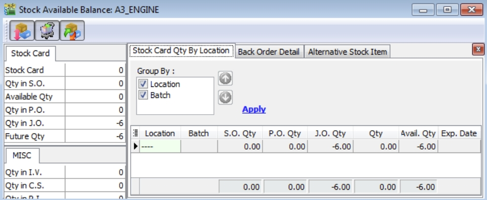

## 1 INTRODUCTION

Sales coordinator usually will input the Sales Order (SO) based on the customer PO received. The stock products will be updated into the system as ordered qty.

If the stock are purchased from supplier, then the purchaser has to transfer from SO to PO. Unless the stock are manufactured, then you have to proceed to Job Order process.

How much of the materials/components required to meet the products ordered by customer? This question raised by the Material Planning department. Therefore, the Job Order takes place as the order to be input after Sales Order. It will planned the materials/components required based on the qty ordered from Sales Order.

When products produce out, you have to transfer the Job Order to Stock Assembly to commit on the stock on hand.

:::info[IMPORTANT]

It is required the SO → PO and Job Order module. For more information about price, please refer to our sales   personal.

:::

## 2 SALES ORDER

1. Create Sales Order (SO)

   Go to **Sales** | **Sales Order…**

   Create and save the customer PO into Sales Order.

   

2. SO Check the Available Stock Balance

   You can press F11 (Available Stock Balance) on the item code highlighted.

   Below is **CAR** stock available balance,

   

   :::note

   **Results for CAR item:**

   SO Qty = -100.00

   PO Qty = 0.00

   JO Qty = 0.00

   Qty (On Hand) = 0.00

   Available Qty = -100.00

   :::

   Below is **WHEEL** stock available balance,

   

## 3 PURCHASE ORDER (TRANSFER FROM SO)

1. Create New Purchase Order (PO)

   Go to **Purchase | Purchase Order…**

   1. Click on NEW button to start with new PO.

   2. Select the Supplier.

   

2. PO Transfer From SO

   1. Right click on P/Order (Title).

   2. Click on Transfer From Sales Order in the menu.

   

3. Document Transfer (SO → PO)

   1. Pick the Item from the SO list.

   2. Input X/F Qty to transfer over PO.

   3. Click OK to proceed.

      

   4. Save the PO Document

      Click on SAVE button.

      

   5. PO Check the Available Stock Balance

      You can press F11 (Available Stock Balance) on the item code highlighted.

      Below is **WHEEL** stock available balance,

      

      :::note

      **Result for WHEEL item:**

      SO Qty = -100.00

      PO Qty = +35.00

      JO Qty = 0.00

      Qty (On Hand) = 0.00

      Available Qty = -65.00

      :::

## 4 JOB ORDER (TRANSFER FROM SO)

1. Create New Job Order (JO)

   Go to **Production | Job Order…**

   1. Click on NEW button to start with new JO.

   2. Select the Customer.

   

   :::info

   > **Customer Info from SO**

   Basically, the customer and others information copy from SO.

   > **Assembly Item Info (Header & Footer)**

   Assembly item transferred from SO. It will determine the BOM Components required and the assembly unit cost.

   > **BOM Components Details**

   Total components quantity requirement to meet the total output.

   :::

2. JO Transfer From SO

   1. Right click on Job Order (Title).

   2. Click on Transfer From Sales Order in the menu.

   

3. Document Transfer (SO → JO)

   1. Pick the Item from the SO list.

   2. Input X/F Qty to transfer over JO.

   3. Click OK to proceed.

   

4. Show Multilevel BOM in Flat Mode

   This function enable to drill down to the flatten level of the multilevel BOM structure. For example, the CAR multilevel BOM structure.

   | Level 0 | Level 1 | Level 2       | Level 3   |
   |---------|---------|---------------|-----------|
   | Car     | Frame   | Front Frame   | Orange    |
   | Car     | Frame   | Front Frame   | Screw     |
   | Car     | Frame   | Back Frame    | Red Light |
   | Car     | Frame   | Back Frame    | Screw     |
   | Car     | Wheel   | Rim           |           |
   | Car     | Wheel   | Tyres         |           |
   | Car     | Engine  | Engine Block  | Filter    |
   | Car     | Engine  | Engine Block  | Screw     |
   | Car     | Engine  | Piston        | Tube      |
   | Car     | Engine  | Piston        | Cover     |
   | Car     | Labour  |               |           |

   Before FLAT MODE, BOM components show at **LEVEL 1**.

   

   Click on Show Multilevel BOM in Flat Mode button.

   It will prompted the below message.

   

   Press NO to keep the BOM components at **LEVEL 1**.

   Press YES to continue flatten the multilevel BOM to **LEVEL 3**.

   After FLAT MODE, BOM components show at **LEVEL 3**.

   

5. Save the JO Document

   Click on SAVE button.

   

6. JO Check the Available Stock Balance

   You can press F11 (Available Stock Balance) on the item code highlighted.

   Below is **component “FRAME”** stock available balance,

   

   :::note

   **Result for component “FRAME” item:**

   SO Qty = 0.00

   PO Qty = 0.00

   JO Qty = -6.00

   Qty (On Hand) = 0.00

   Available Qty = -6.00

   :::

   Below is **component “WHEEL”** stock available balance,

   

   :::note

   **Result for component “WHEEL” item:**

   SO Qty = -100.00

   PO Qty = +35.00

   JO Qty = -24.00

   Qty (On Hand) = 0.00

   Available Qty = -89.00

   :::

   Below is **component “ENGINE”** stock available balance,

   

   :::note

   **Result for component “ENGINE” item:**

   SO Qty = 0.00

   PO Qty = 0.00

   JO Qty = -6.00

   Qty (On Hand) = 0.00

   Available Qty = -6.00

   :::

## 5 STOCK ITEM ASSEMBLY (TRANSFER FROM JO)

1. Create New Stock Item Assembly (AS)

   Go to **Production | Stock Item Assembly…**

   Click on NEW button to start with new AS.

   

2. AS Transfer From JO

   1. Right click on Item Assembly (Title).

   2. Click on Transfer From Job Order in the menu.

      

3. Document Transfer (JO → AS)

   1. Pick the Item from the JO list.

   2. Input X/F Qty to transfer over AS.

   3. Click OK to proceed.

   

4. Save the AS Document

   Click on SAVE button.

   

5. AS Check the Available Stock Balance

   You can press F11 (Available Stock Balance) on the item code highlighted.

   Below is **component “FRAME”** stock available balance,

   

   :::note

   **Result for component “FRAME” item:**

   SO Qty = 0.00

   PO Qty = 0.00

   JO Qty = -2.00

   Qty (On Hand) = -4.00

   Available Qty = -6.00

   :::

   Below is **component “WHEEL”** stock available balance,

   

   :::note

   **Result for component “WHEEL” item:**

   SO Qty = -100.00

   PO Qty = +35.00

   JO Qty = -8.00

   Qty (On Hand) = -16.00

   Available Qty = -89.00

   :::

   Below is **component “ENGINE”** stock available balance,

   

   :::note

   **Result for component “ENGINE” item:**

   SO Qty = 0.00

   PO Qty = 0.00

   JO Qty = -2.00

   Qty (On Hand) = -4.00

   Available Qty = -6.00

   :::

## 6 OFFSET QTY

### Offset Qty In Sales Order

What is purpose of the OFFSET Qty in Sales Order? You will see a new column name “OffSet Qty”. It allowed you to input a value to increase/reduce the original QTY be transfer to Purchase Order and Job Order.

   

   1. Positive Offset Qty

      REDUCE the Transferable QTY to PO and JO.

      For example,

      | SO Original Qty | OffSet Qty     | Transferable to PO/ JO |
      |-----------------|----------------|------------------------|
      | 100.00          | 0.00 (default) | 100.00                 |
      | 100.00          | +15.00         | 85.00                  |

   2. Negative Offset Qty

      INCREASE the Transferable QTY to PO and JO.

      For example,

      | SO Original Qty | OffSet Qty     | Transferable to PO/ JO |
      |-----------------|----------------|------------------------|
      | 100.00          | 0.00 (default) | 100.00                 |
      | 100.00          | -15.00         | 115.00                 |

## 7 REPORTS

1. Print Job Order Listing

   Go to **Production** | **Print Job Order Listing…**

2. Print Outstanding Production Document Listing

   Go to **Production** | **Print Outstanding Production Document Listing…**
