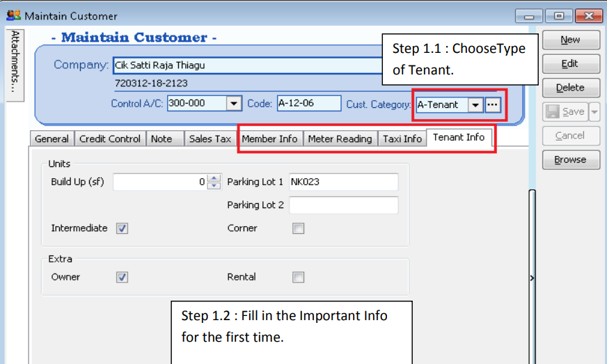
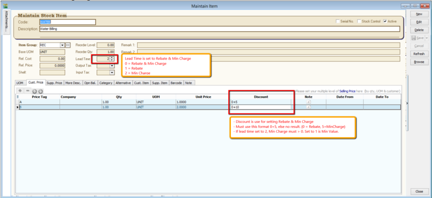
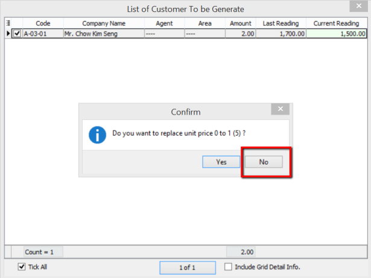
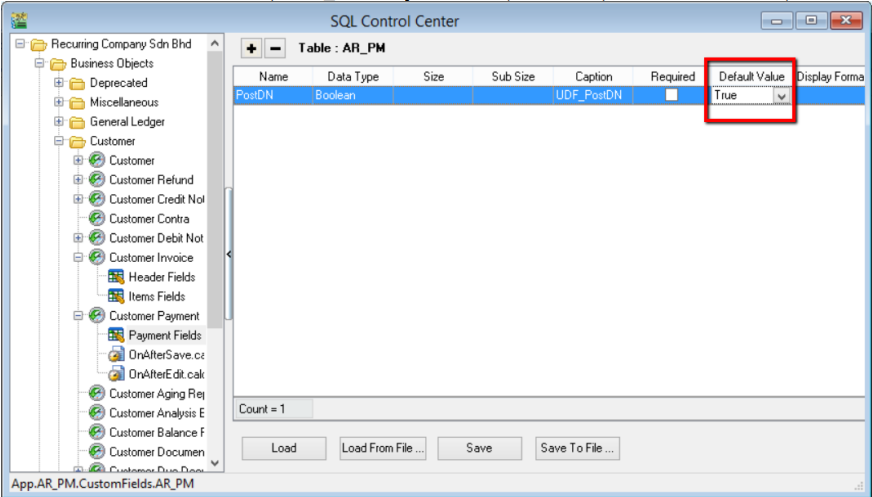

:::info[module required]
    - DIY Field
    - DIY Script
    - Multiple Pricing (Price Tag)
:::

## Steps & Instructions

Use Company Category for filtering

1. Customer | Maintain Customer | Cust. Category = Filtering

    

2. Sales | Quotation |

    >DocNo Format := CompanyCategoryCode;Type

    - CompanyCategoryCode must exactly same as Maintain Customer Category Code
    - Type = For own reference to differentiate the purpose for the IV

    Eg :
    - A-Tenant;Main => For Maintenance
    - A-Tenant;Water => For Water Billing
    - A-Tenant;Park => For Car Park

    

    

    

3. Sales | Invoice | Invoice auto generated.

    ***Master Description***

   >- If using 1.Generate Maintenance it will use the Quotation Master Description.
   >- If using 2.Generate Water it will shown how much the water usage [Master Description (MMM YYYY) - CurrentReading - PreviousReading=Usage@UnitPrice].
   >- If using 2.Generate Water with "Include Grid Detail Info." Option tick it will use the Quotation >Master Description.
   >- Rounding Mechanism only for WATER & ELECTRIC Itemcode
   >- Make sure the UDF_WaterReading In Maintain Customer Default is 0 & not null.

    ***For Stock item***
    >- Must have ItemCode = WATER
    >- Must have ItemCode = ELECTRIC
    >- Must have Item Code = RTN5Cents
    >- Must have ItemCode = OVERDUE is to record the interest Charges Rate
    >- Price Tag => For Different UnitPrice for WATER & ELECTRIC

    *Use Disc column as Rebate and Min Charge => **Format := Rebate+MinCharge***

    Eg.
    >- Rebate 11.75 & MinCharge 5 => 11.75+5
    >- Rebate 0 & MinCharge 5 => 0+5
    >- Rebate 12.30 & MinCharge 5 => 12.

    - Lead Time :
      - 0: Both,
      - 1: Rebate Only,
      - 2: Min Charge Only

    Refer below sample picture:

    

    When you press ok, system will prompt this message as below :

    

   1. Press **No** so that the system will capture the *Price* you have set at **Cust Price Tab**.

   2. You may turn off this message from access right -> Tools | Maintain User | Edit | More |
   Access Right | Group | Untick Prompt Replace Unit Price Dialog (Except for ADMIN USER
   due to full access right)

   3. You may set the **QTY** in **Maintain Item Cust Price Tab** to capture **Min Qty** to have **Min
   Charges**.

   4. For Water & Electric :
        - If Current Reading - Last Reading &lt;= QTY(set in CustPrice), system will capture MinPrice RM 5
        - Else If Current Reading - Last Reading >= QTY(set in CustPrice), system will capture Cust Price Tab UnitPrice Column
        - If did not set any price tag, then unitprice will always RM 1.(Advise set in cust price)

   5. For Generate Maintainance
       - Price will follow QT unitprice

## Extra Information

- In Sales Document Listing
  - Is a batch delete base on the parameter selected.
  - Once inovice has been deleted, the meter reading updated to **Maintain Customer** is unable to revise back. User still has to manually amend in **Maintain Customer**.

- In Customer Due Listing(Calc Interest Charges)
  - Auto generate sales debit note for overdue invoice.
  - The rate is from Ref Price of **OVERDUE** Itemcode (just enter 0.1 for 10% pa)
  - Must click on **Apply Button** first before click on **Post DN Button** (else will prompt Null Point Exception error)
  - **Interest Charges** calculation is excluded Tax Amount

  - **Formula for UnitPrice :**
        >- A = TaxAmount \* Outstanding/DocAmt
        >- B = Outstanding – A
        >- Unitprice = (Rate/365) \* B

    :::info[note]
    Rate is captured from Maintain Item code = OVERDUE, RefPrice column.
    :::

  - **Formula for Qty :**
    >If Age < Calendar of the Month then
    >>Qty = Age
    >
    >Else
    >
    >>Qty = Based on the calendar day of the month
    >
    >Subtotal = Unitprice * Qty

  - **Debit Note Date** = Customer Due Document Date

- **In Customer Payment**
  - Will auto generate Overdue Debit Note if the Knock-off Invoice is overdue.
  - User can set **Default Value** to ***False*** (at AR_PM - Payment Field), if not used (**Default Value** is set to ***True***)

        

    Formula: Rate/365 * KOAmt

    :::info[note]
    Rate is capture from Maintain Item code = OVERDUE, RefPrice column
    :::
