## Batch Email with PDF Filename & Current Date

- This guide will teach you on how to capture current date on your export PDF File Name.

1. In QT Template DocNo = EMAIL, PDF File Name may set in **Remark 2**

    

    :::info[note]
    Remark 2 must fill in
    :::

2. Preview your report | Click on **Report Name**

    

3. Click on **Code Tab** |

    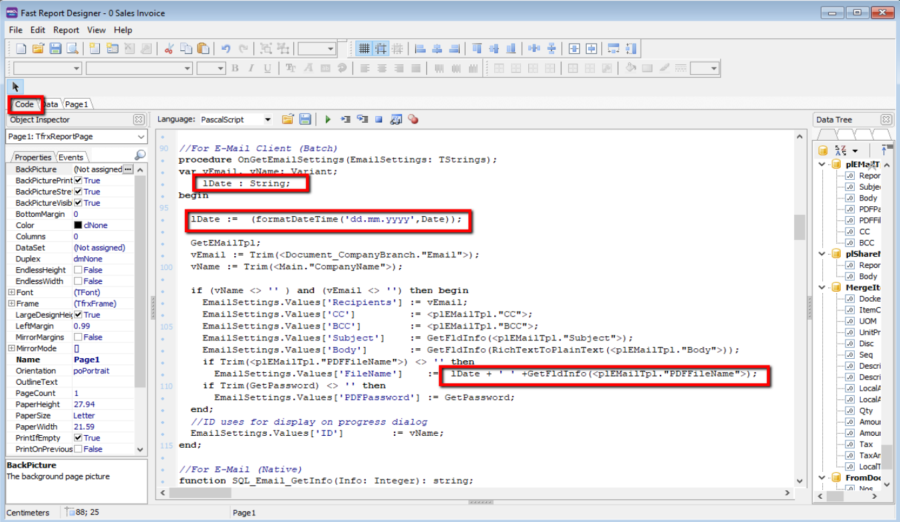

```pascal
procedure OnGetEmailSettings(EmailSettings: TStrings);
var
    vEmail, vName: Variant;
    lDate : String;
begin
    lDate := (formatDateTime('dd.mm.yyyy',Date));

    GetEMailTpl;
    vEmail := Trim(<Document_CompanyBranch."Email">);
    vName := Trim(<Main."CompanyName">);

    if (vName <>  '' ) and (vEmail <>  '') then begin
        EmailSettings.Values['Recipients'] := vEmail;
        EmailSettings.Values['CC'] := <plEMailTpl."CC"> ;
        EmailSettings.Values['BCC'] := <plEMailTpl."BCC"> ;
        EmailSettings.Values['Subject'] := GetFldInfo(<plEMailTpl."Subject">);
        EmailSettings.Values['Body'] := GetFldInfo(RichTextToPlainText(<plEMailTpl."Body">));

        if Trim(<plEMailTpl."PDFFileName">) <>  '' then
            EmailSettings.Values['FileName'] := lDate + ' ' +  GetFldInfo(<plEMailTpl."PDFFileName">);
        if Trim(GetPassword) <>  '' then
            EmailSettings.Values['PDFPassword'] := GetPassword;
    end;

    EmailSettings.Values['ID'] := vName;
end;
```

## Display More Description in Multiple Page

- If More Description more than 1 page, first page will show blank.

- Example Problematic Report :

   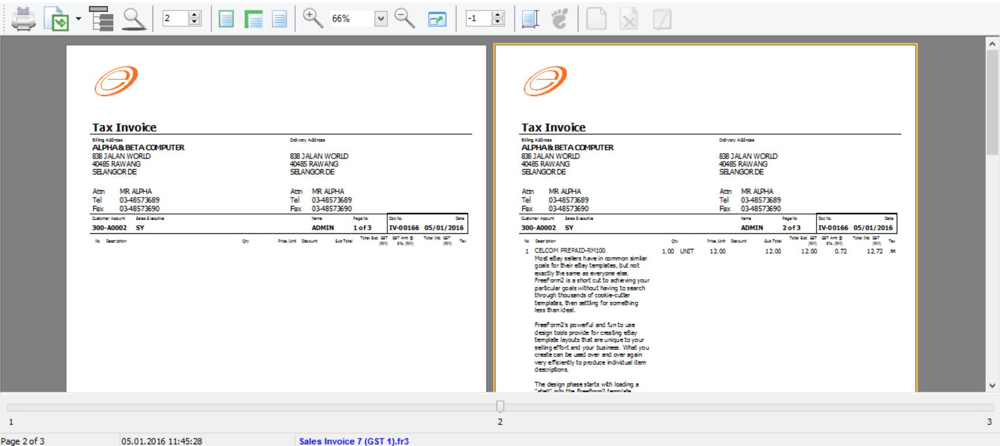

**Solution:**

1. Click on ***Blue Color Report Name*** in bottom.

   1. Click on **DetailData1**

   2. Click on **Events**

   3. Double Click on **OnAfterCalc Script**

        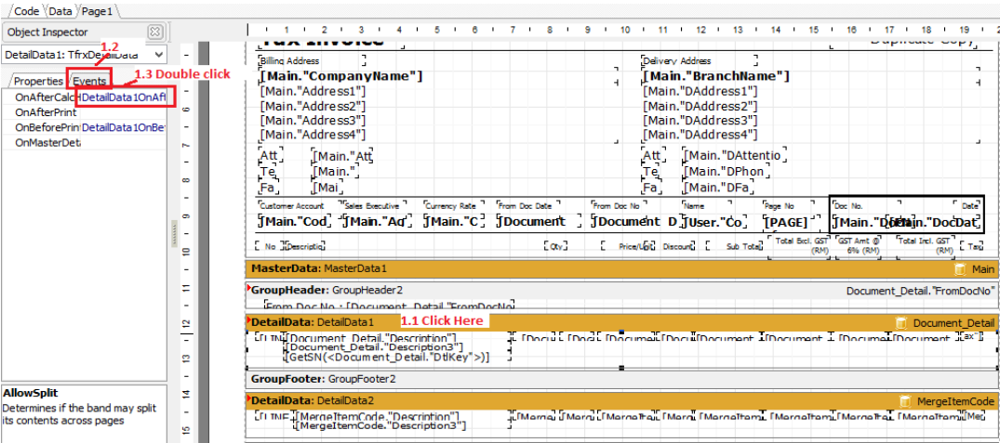

   4. The system will redirect to Code Page, then disable the script by adding the symbol '**//**' infront of the script.

        

   5. Go back to **Page1 Tab**

        

   6. Right Click on **DetailData1** | Tick **Allow Split**.

        

   7. Right Click on **Qty DBText** | Untick **Auto Width**.

        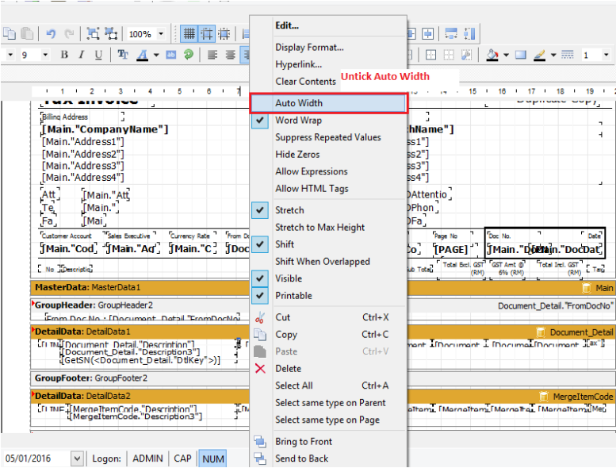

   8. Do the same Step 7 for **UnitPrice**, **SubTotal**, **Total Exc GST**, **GST Amt**, **Total Inc GST** and **Tax**

        

   9. Click on **Group Footer1**

   10. Click on **Events**

   11. Double Click on **OnBeforePrint**.

        

   12. In Code Page, Remove the "**– 60**" from the code

        **Before:**

        

        **After Amend:**

        

   13. Go Back to **Page1 Tab** | make **Page footer1** closer.

         

   14. Go to File | Page Setting | Bottom set to 2.5

         

   15. File | Save As | Input New Report Name

   16. Preview again

   17. Problem Solved

         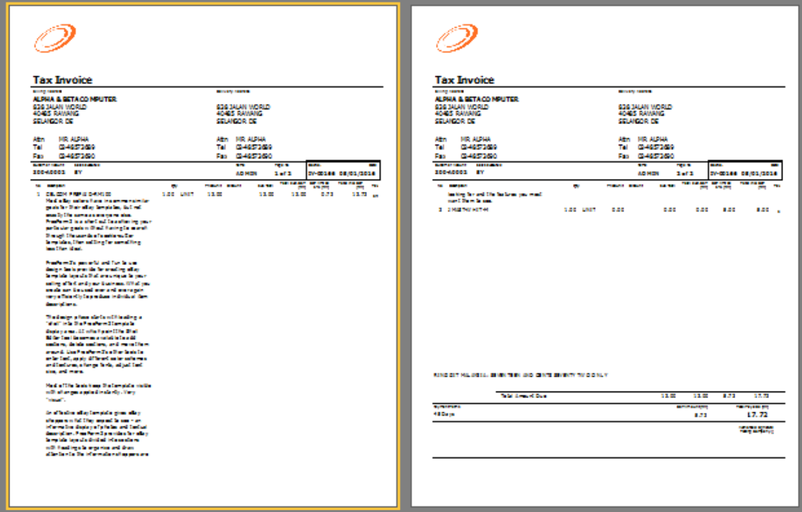

## Display Text Object in Last Page's Footer only

1. Click on the object you want to show only in Last Page

   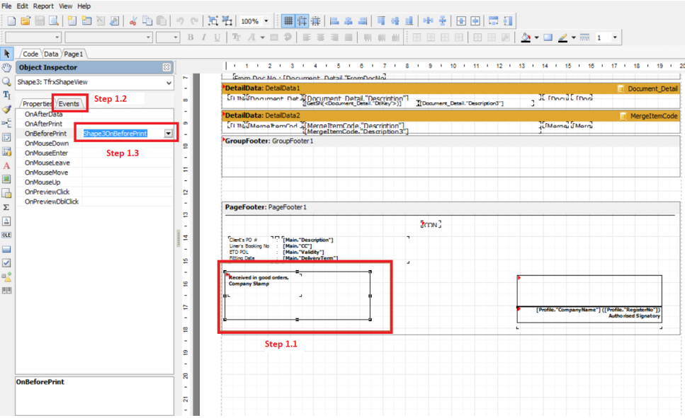

   1. Click on your Object
   2. Click on Events Tab
   3. Click on OnbeforePrint | Double Click it
   4. Place this query inside the Code page.

        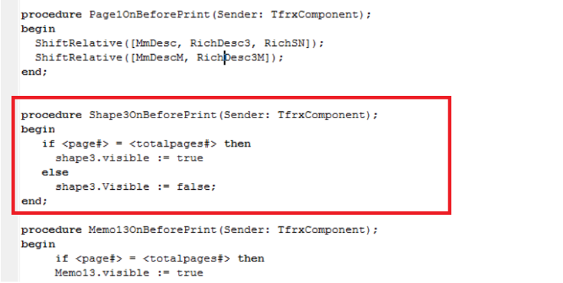

    Code:

    ```pascal
    if <page#> = <totalpages#> then
        shape3.visible := true
    else
        shape3.Visible := false;
    ```

## Fix Report Tax Rate show A instead of 6%

1. Preview the Report format, Click on blue color link and enter into Report Design. (Refer **Pic1**)

    **Pic1:**

    

2. Click on Code Tab(Refer **Pic2**)

    **Pic2:**

    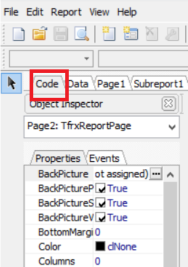

3. In Code page insert TaxRate (Refer **Pic3**)

    **Pic3:**

    

    **Full Query :**

    ```pascal
    SQL := 'SELECT Code, TaxRate FROM Tax ' +
                'WHERE ISACTIVE=1 ' +
                'AND (TAXTYPE=0X00010000+0X00020000 OR ' +
                '((TAXTYPE / 0X00020000 / 2) - (TAXTYPE / >0X00020000 / 2.0)) &lt;> 0) ' +
                ' ORDER BY CODE';
                AddDataSet('GSTTax', ['Code', 'TaxRate'])
                .GetDBData(SQL)
                .LinkTo('GSTAmt', 'Tax', 'Code');
    ```

4. Click on SubReport1 Tab | Click on the Text Field (Refer **Pic4**)

    **Pic4:**

    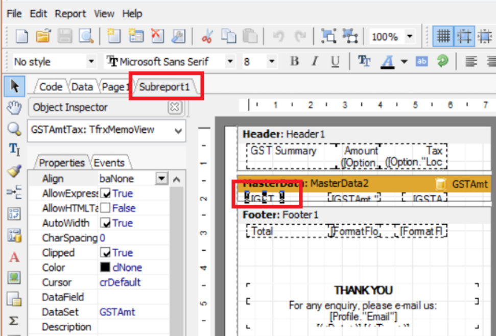

5. Change the Query as below | Press OK (**Pic5**)

    **Pic5:**

    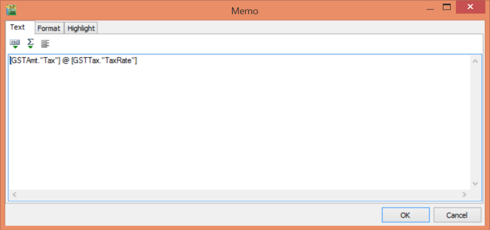

6. File | Save

7. Close the Fast Report

8. Preview the same format again.

## Hide Zero Value

1. Method 1

   1. Right Click on the Text | Select Hide Zeros

   2. Tick Allow Expressions

        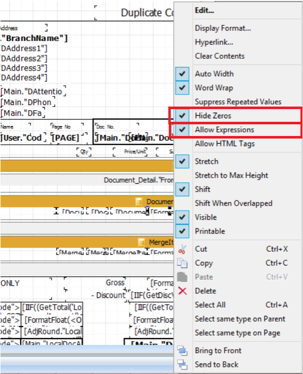

   3. Try save the report and preview the result.

2. Method 2 (**Only use this if method 1 doesn't work**)

   1. Double click on Text

   2. Click on Highlight Tab

   3. Press Add

        

   4. Press ok

   5. Untick Visible

        

   6. File | Save as | Enter Report name
   7. Preview and see the result

## Ledger Report Start New Page for New Group

**Before Amend :**

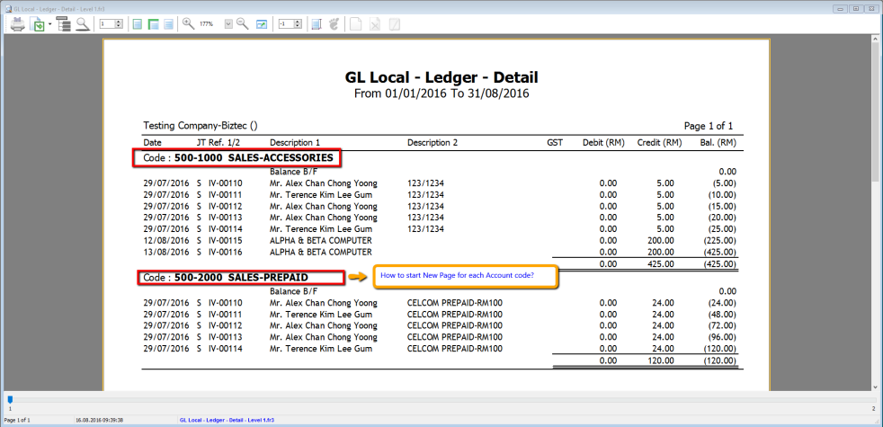

1. **Right Click** on **Group Header 1**, Select **Start New Page**

    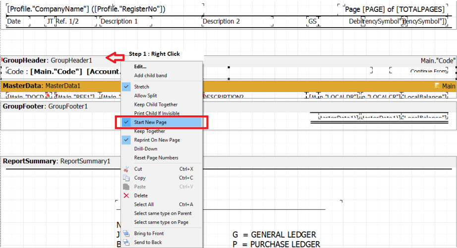

2. File | Save as | Enter New Report Name

3. Preview

    

## Print Date Time

1. Click on Text Object

    

2. Enter **[Date] [Time]**

3. File | Save as Enter New Report Name

    

4. Preview

    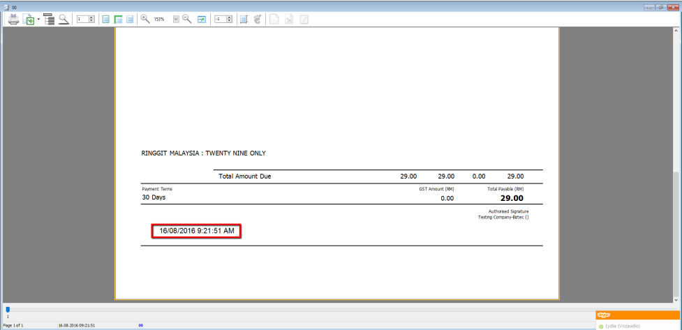

## Report Print Count

**Report Before Set Report Count :**


**Step to do :**

1. Go into Report Design

2. Click on DetailData1

3. Click On Events Tab

4. Double Click on OnBeforePrint.

    

5. System will auto bring you to the code page. Insert the Query as Below :

    ```pascal
    if TfrxDetailData(Sender).Visible and (<Line#> mod 20 = 1) and (<Line#> > 1) then Engine.NewPage;
    ```

    If you want to change the Record Count to 15, just change the count:

    ```pascal
    if TfrxDetailData(Sender).Visible and (<Line#> mod 15 = 1) and (<Line#> > 1) then Engine.NewPage;
    ```

6. Go to File | Save As | Insert New Report Name

7. Preview with New Report Name.

    

## Set Stop Position

**Example of setting the Stop Position with 912 Pixel :**

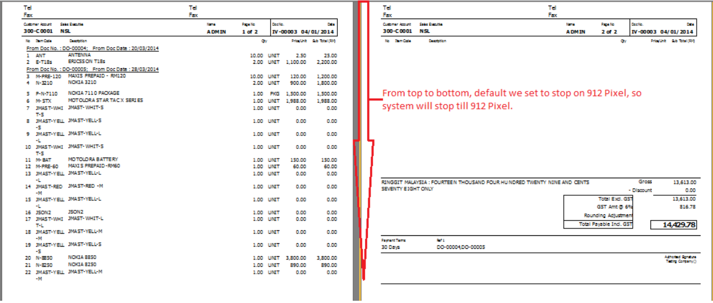

1. Go into Report Design

2. Click on **DetailData1**

3. Click on **Events**

4. Double Click **onAfterCalcHeight**.

    

5. The system will redirect to Code Page

    :::tip[TIPS]
    If you want to stop on 9 Inch, then you have to convert to Pixel.

    1 Inch = 96 Pixel, So if you want stop on 9 Inch, then use 9 *96 = 864 Pixel.
    :::

    

    **Code**:

    ```pascal
    if TfrxDetailData(Sender).Visible and (Engine.CurY + DetailData1.Height >= 864) then Engine.NewPage;
    ```

6. File | save as | Enter New Report Name

7. Preview with new report name to see the result.

**Example Result after set to 864 Pixel :**

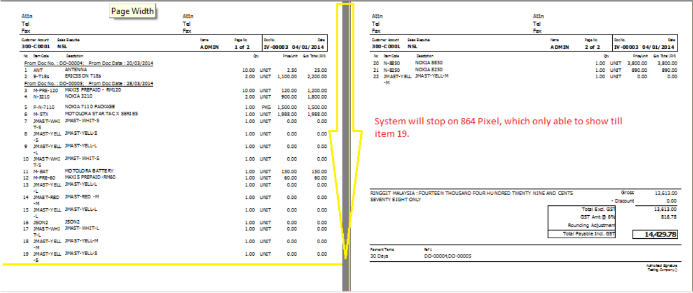

## Update GST from 6% to 0% (show zero instead of blank)

SQL Account system build in report format will automatic detect your Tax Rate based on your invoice issued.

- If invoice issued on May, it will show GST @ 6%, while invoice issued on June, it will display GST @ 0%.
- If your Delivery Order (D/O) is issued on May, transferred to Invoice and invoice date on June, the system will automatic detect and set your GST rate correctly.
- However, if your format customized previously, you can refer this guideline on how to change the script from GST @ 6% to GST 0%.

1. Click on your report name to enter into report designer page.

    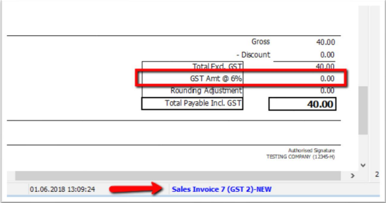

2. Refer to the image below for the follow instructions,

   1. Click on this field, you can double check on left panel, the field name is **MmGST2**

   2. go **Event**

   3. double click the empty area beside **OnBeforePrint**, system will bring you to step iv as below

        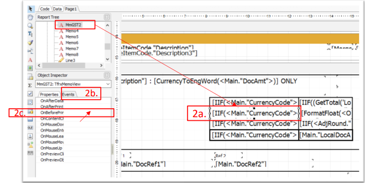

   4. **replace to this script**

        

        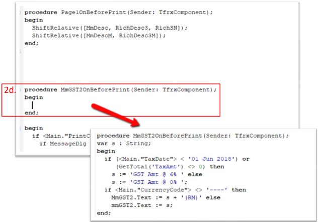

3. Once you complete the steps above, Click file > **save as**, enter a new report name and exit, then you may preview again your format outcome.
