## Add FromDocNo and FromDocDate Variable in Report Design

1. Go in Report Design | Click on  then place at the grid – refer below Pic

   

   1. Right Click on Variable2 | Select Calculation |

      

      After Done press OK

2. If the date is not appearing in report preview

   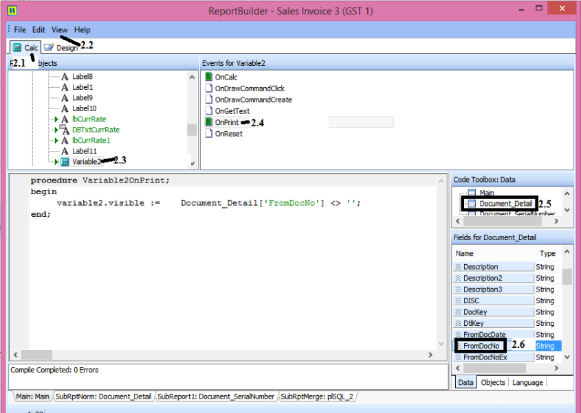

   1. Click on **Calc Tab**

   2. **Menu bar** | click **View** | Select **Events**

   3. Look for ***Variable***

   4. Click on **OnPrint**

   5. Click on **Document_Detail**

   6. Click on **FromDocNo**

   7. Drag from **FromDocNo** to the query box.

## Create SUM Variable for TAX Column


1. Click on the variable icon

2. Click on where you want to create a new variable, right click on the variable created > go calculations , Insert the query in the next section accordingly

3. Click on the variable created, and make sure choose it to `DOUBLE`.

**Query:**

1. **Formula for Sub Total**

    ```pascal
    Variable1.DisplayFormat := Option.GetFieldValue('AccountingValueDisplayFormat');

    Value := GetAggregateValue(agSUM, Document_Detail, 'DocKey', 'Amount');
    ```

2. **Formula for Total Exclude GST (RM)**

    ```pascal
    Variable2.DisplayFormat := Option.GetFieldValue('AccountingValueDisplayFormat');

    Value := GetAggregateValue(agSUM, Document_Detail, 'DocKey', 'LocalAmount');
    ```

3. **Formula for Total of Tax Amt (RM)**

    ```pascal
    Variable5.DisplayFormat := Option.GetFieldValue('AccountingValueDisplayFormat');

    Value := GetAggregateValue(agSUM, Document_Detail, 'DocKey', 'LocalTaxAmt');
    ```

4. **Formula for Total Include GST (RM)**

    ```pascal
    Variable6.DisplayFormat := Option.GetFieldValue('AccountingValueDisplayFormat');

    Value := GetAggregateValue(agSUM, Document_Detail, 'DocKey', 'LocalAmountWithTax');
    ```

## Disable Query for Deleted Field

1. If you had deleted any field in report designer with Query, then u will get the below message, click **OK**

   

2. Click on the blue colour report name to enter in report designer page

   

3. Click on the field, the field name will be shown at the left bottom of the application as shown below. If you had deleted the field, refer to step 4.

   

4. Click on **CALC**, go View > Modules

   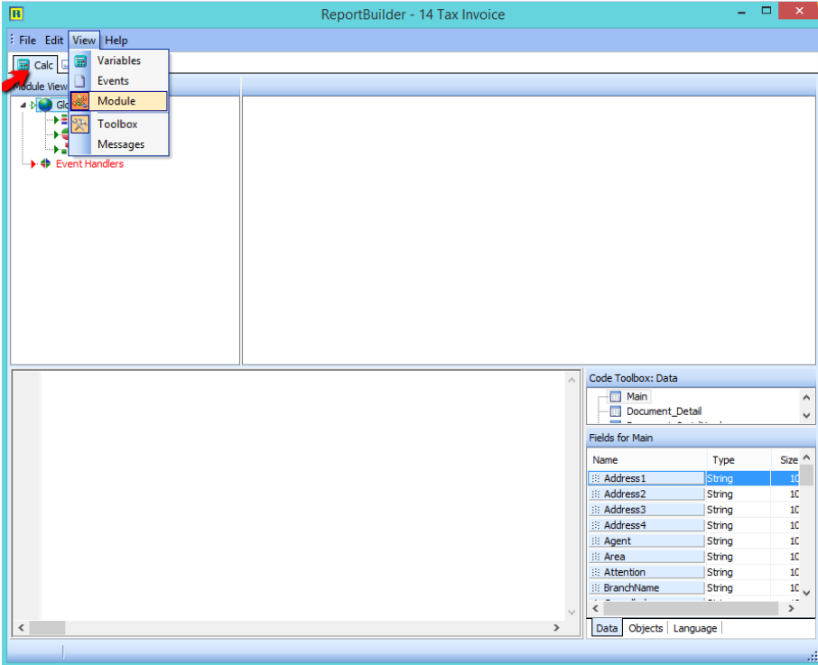

5. Follow the steps below:

   1. Click on **Event Handlers**

   2. Go to **procedure DetailBeforePrint**

   3. An error will be shown at the bottom, double click on it, and the system will redirect to the row with the error

   

6. Enter '//' as in the image below :

   

7. Right click and compile , make sure no error > save > close the preview screen and try preview again.

:::info[Note]
You can also refer to the guidance video at [HERE](https://www.sql.com.my/) regarding the above issue.
:::

## Display Exemption Number & Expiry Date in Invoice Template

### Part A : Custom | Maintain Customer


### Part B : Report Format add customer exemption Number

1. Go to Sales | Sales Invoice | Select any of your invoice | Preview | choose your invoice format template | click on the bottom blue color report name to go into report designer page

   

2. Insert **Exemption Number** label

   1. click on the A label icon
   2. click on the area that you want to locate the field
   3. rename the label

   

3. Insert **Tax Exemption Number** DBText

   1. click on the DBText field
   2. click on the are that you want to located the field
   3. select Document Company & TaxExemptNo

   

4. Insert **Expiry Date** label

   1. click on the A label icon
   2. click on the area that you want to locate the field
   3. rename the label

   

5. Insert **Tax Expiry Date** DBText

   1. click on the DBText field
   2. click on the are that you want to located the field
   3. select Document Company & TaxExpDate

   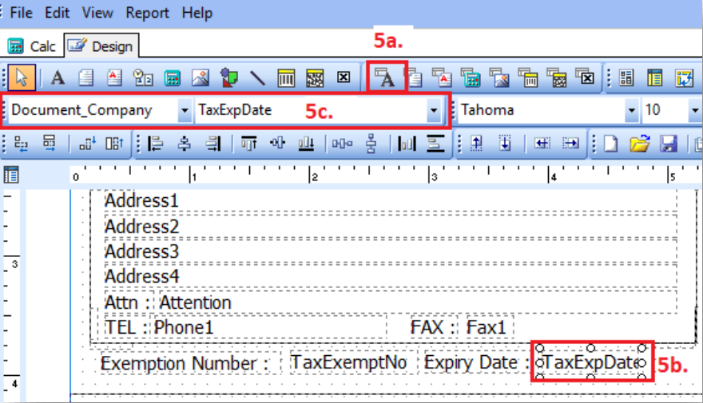

### Part C: Save as a new report name & preview the new format

1. Once you complete, go file | save as | enter a new report name | Save

   

2. Preview your new report

   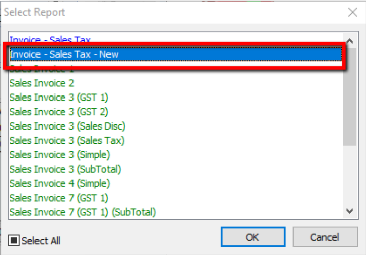

3. The exemption number & expiry date added

   

## Drag XML Report into SQL

:::info[note]
If this XML Report is Customer Aging, go Customer Aging to drag the XML Report

If this XML report is Supplier Aging Report, go to Supplier Aging to drag the XML Report
:::

1. Open the XML Report & also Customer Aging, drag the XML Report into the Report Name field

   

2. Double Click on the new report template in blue color.

   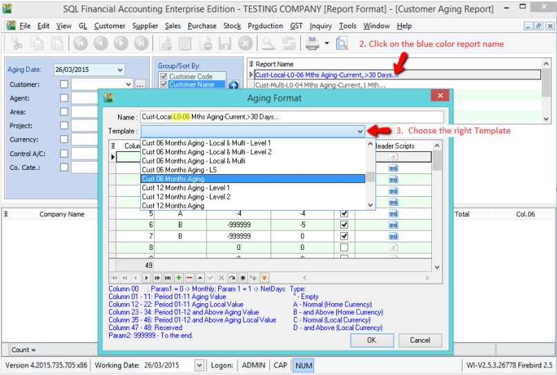

3. Click on the arrow down key to choose the right template

   - Eg : If the report Name is Cust-Local-**L0**-06 Month

      - L0 = no special grouping, the template you have to choose eg Cust 06 Month Aging
      - L1 = Grouping by 1 level, the template you have to choose eg Cust 06 Month Aging – Level 1
      - L2 =Grouping by 2 level, the template you have to choose eg Cust 06 Month Aging – Level 2

   - Eg : If the report Name is Cust-Local-L0-**06** Month

     - 04 = 04 Month
     - 06 = 06 Month
     - 12 = 12 Month

## Fix Report Tax Rate show A instead of 6%


1. Preview the Report format, Click on blue color link and enter into Report Design.

   

2. Check GST Summary using which Pipeline | This Report using plSQL_7.

   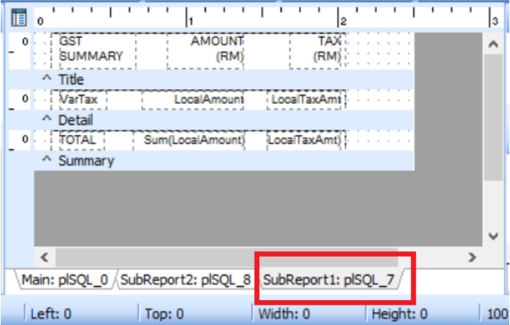

3. Click on Calc Tab.

   

4. Click on Menu View | Select Module

   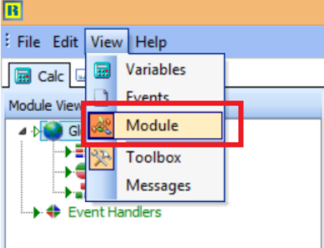

5. Click on Events | Click on Main:plSQL_0 | Look for SQL_7(Refer Step 2 to see which pipeline) | Insert TaxRate

   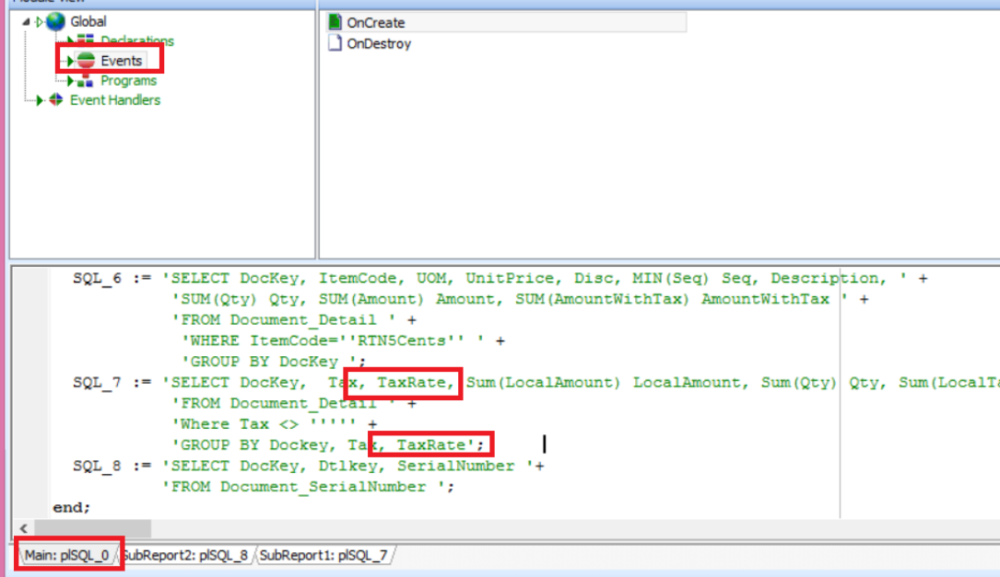

   Query:

    ```sql
    SQL_7 := 'SELECT DocKey, Tax, TaxRate, Sum(LocalAmount) LocalAmount, Sum(Qty) Qty, Sum(LocalTaxAmt) localTaxAmt, Description '+
        'FROM Document_Detail ' +
        'Where Tax &lt;> ''''' +
        'GROUP BY Dockey, Tax, TaxRate';
   ```

6. Click on Event Handler | Select Procedure ReportBeforePrint | Look for Pipeline SQL_7 | Insert TaxRate

    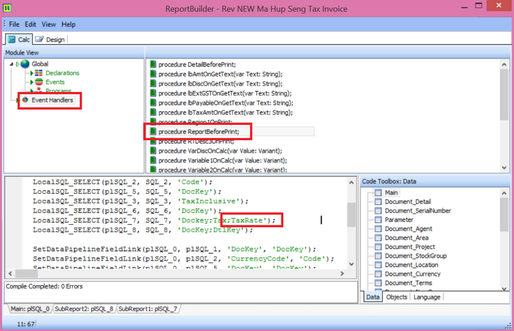

    Query:

    ```pascal
    LocalSQL_SELECT(plSQL_7, SQL_7, 'Dockey;Tax;TaxRate');
    ```

7. Click on SubReport1:plSQL_7 Tab

    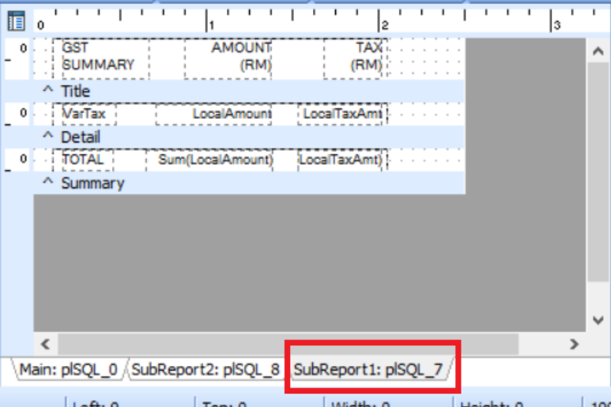

8. Click on VarTax | Right Click | Select Calculation

   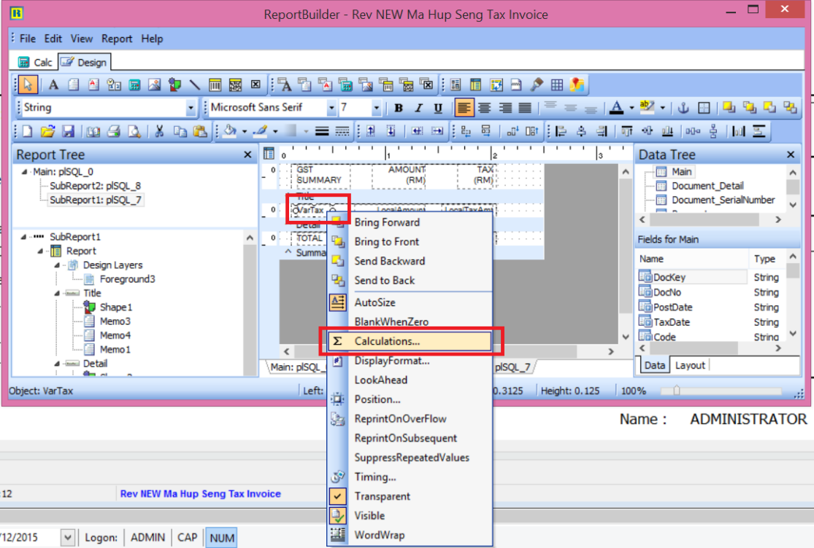

9. Amend the Query | Press OK

   - Before Amend:

        

   - After Amend:

        

   Query:

    ```pascal
    Value := plsql_7.getfieldvalue('Tax') + ' @ ' + plsql_7.getfieldvalue('TaxRate');
    ```

10. File | Save

    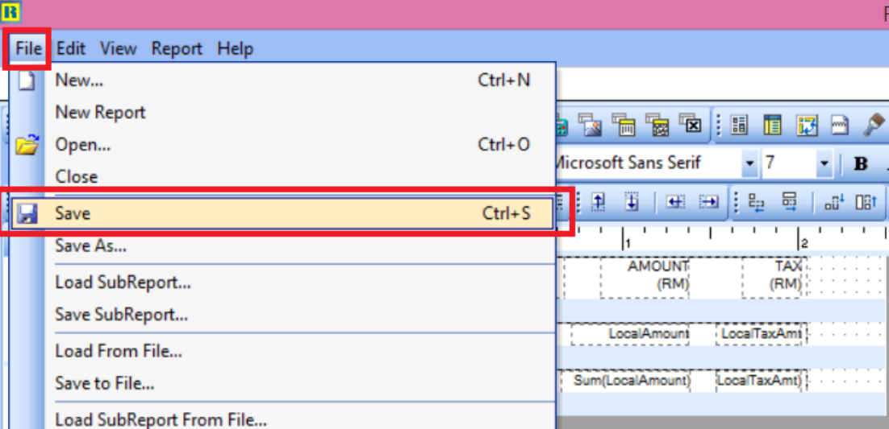

11. Close the report builder

12. Preview again the same report format.

    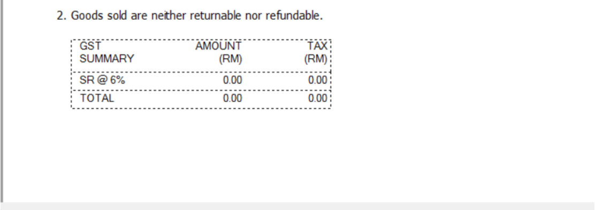

## Official Receipt Format Set Knock Off Grid to Show Full Width

1. Go to **subreport1 : Document_KnockOff**

    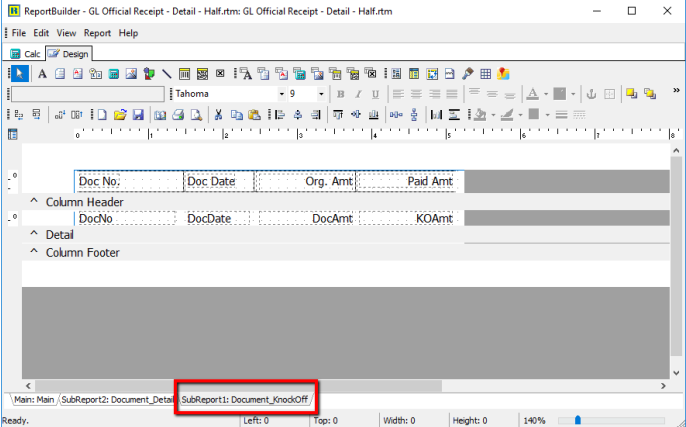

2. Go to **Report**, click on **Title**

    

3. Move all field in Column Header to **Title**

    

4. Go to **File** > **Page Setup...**

    

5. Go to **Layout**, change the **column** to ***1***

    

6. Now, it expands to full page, you can adjust all your column as your wish.

    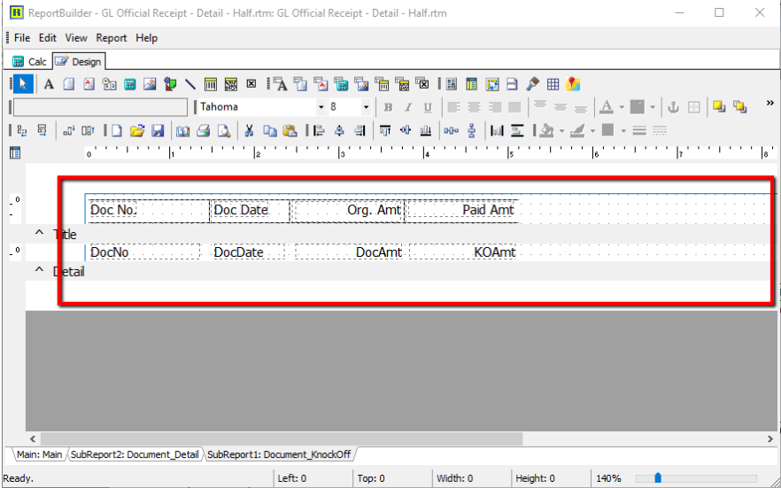

7. Once you done adjust, go file > save as, key a new report name.

8. Close the preview, and preview your new report name.

## Rounding of Figure in Report

**Sample Invoice with Rounding RM0.02 :**


1. Using Tax Invoice format 06-Tax-Invoice
   

   :::info[note]
   Click on blue color link - **06-Tax-Invoice**
   :::

2. Click on **Calc** Tab

   

3. Right Click select **Module**

   

4. Click on **Declarations**

   

5. Declare **SQL_Rounding** under **Variable**

   

6. Click on Events | On Create | Procedure GlobalOnCreate insert syntax as below :

    ```pascal
    SQL_Rounding := 'SELECT DocKey, Sum(Amount) Amount, Description '+
    'FROM Document_Detail ' +
    'WHERE ItemCode=''RTN5Cents'' '+
    'GROUP BY DocKey';
    ```

    **Refer Picture below :**

   

    :::info[Optional]
    Add additional syntax in plSQL_4 – Refer below, only if Total Amount beforeGST you want to exclude rounding amount.

   

    ```pascal
    SQL_4 := 'SELECT DocKey, Sum(Amount) Amount, Description '+
    'FROM Document_Detail ' +
    'WHERE ItemCode <> ''DISC'' '+
    'or Itemcode is null ' +
    'and ItemCode <> ''RTN5Cents'' ' +
    'GROUP BY DocKey';
    ```

   :::

7. Click on Event Handlers | Click on procedure Report BeforePrint, insert syntax as below :

    ```pascal
    LocalSQL_SELECT(plSQL_Rounding, SQL_Rounding, 'DocKey');
    SetDataPipelineFieldLink(Main, plSQL_Rounding, 'DocKey', 'DocKey');
    ```

   

8. File | Save | Exit from report design and go in to Report Design again.

9. Insert DBText | and place at the place you want.

   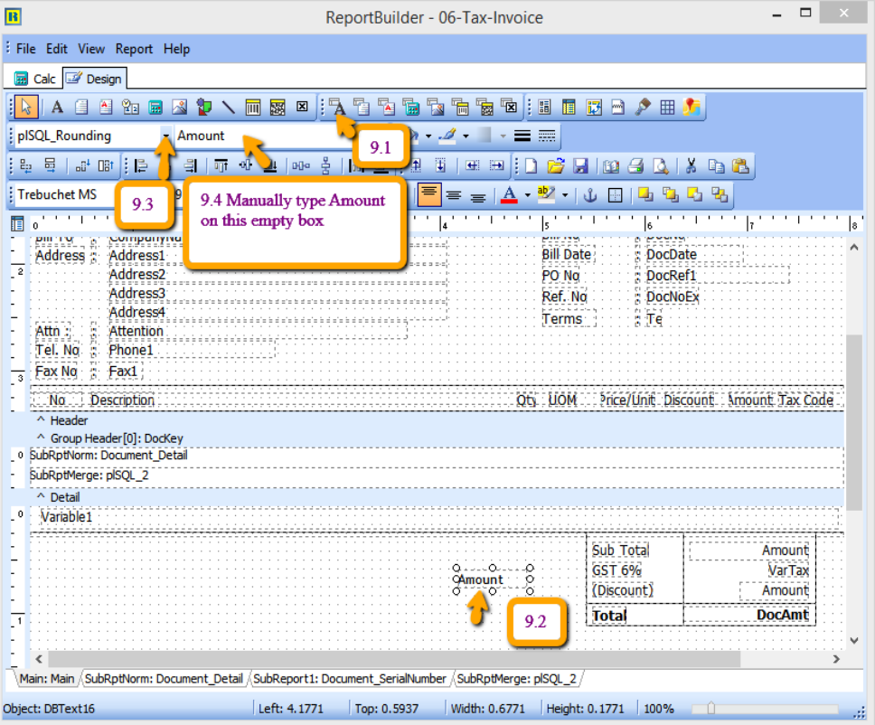

   1. Click on DBText

   2. Place at the Group Footer area

   3. Select plSQL_Rounding

   4. Manually type in Amount

   Here is the output :

   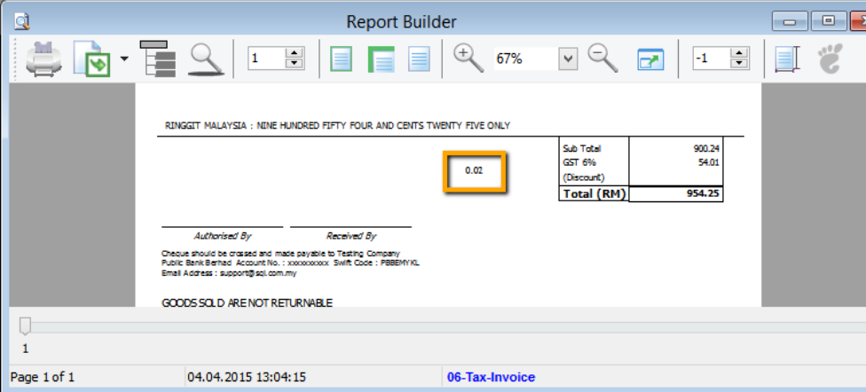

   After adjust the position :

   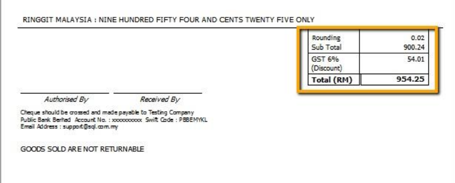

    **Item Detail hide Item Code RTN5Cents to be appearing, refer step as below :**

10. Click on Document_Detail Tab as below | Click on Calc | Event Handlers | Procedure RdiscOnPrint

    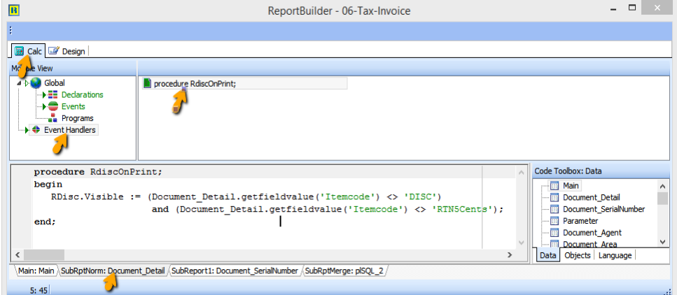

    - Syntax:

        ```pascal
        RDisc.Visible := (Document_Detail.getfieldvalue('Itemcode') <> 'DISC')
        and (Document_Detail.getfieldvalue('Itemcode') <> 'RTN5Cents');
        ```

    - Output :

        

        **How to do if the report never create the region before?**

11. Right click tick all the Toolbars

    

12. Click on Region component

    

13. Place at the design grid | Click at the region | Select no Fill

    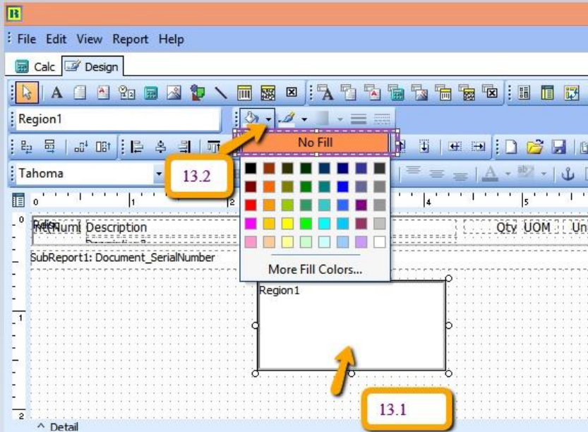

14. Select No Line

    

15. Place all the DBtext/DBRichText inside the Region.

    

16. Click on Region to check the object name :

    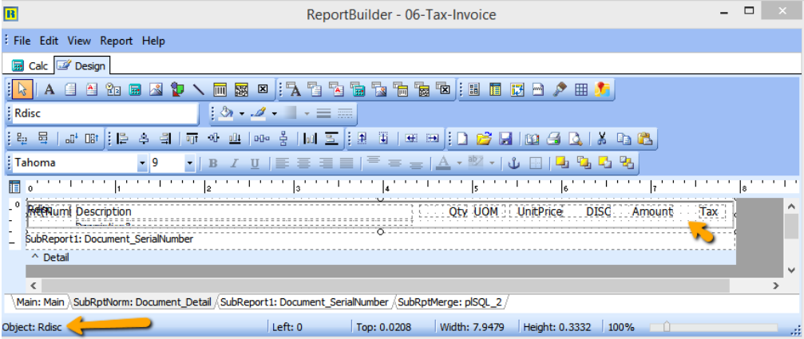

17. Click on Calc tab | Right Click select Events

    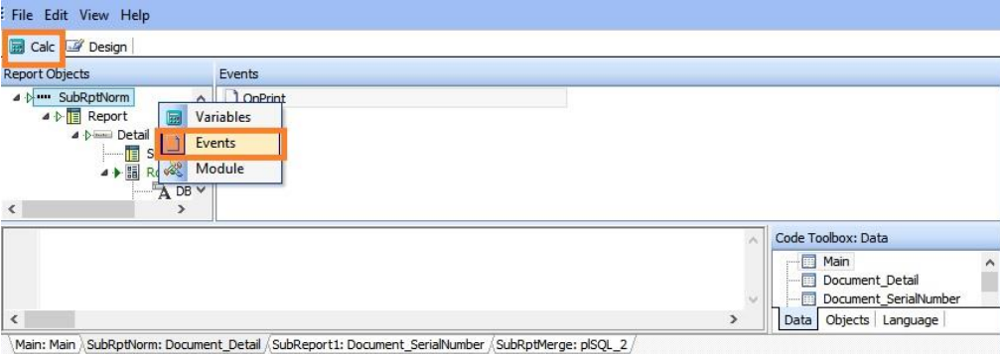

18. Look for RDisc | Select OnOnPrint | Place the syntax inside bottom box

    

    Syntax :

    ```pascal
    RDisc.Visible := (Document_Detail.getfieldvalue('Itemcode') <> 'DISC')
    and (Document_Detail.getfieldvalue('Itemcode') <> 'RTN5Cents');
    ```

    :::info[note]
    **RDisc** is your object name, if you object name is **Region1**, then have to change as below :

    ```pascal
    Region1.Visible := (Document_Detail.getfieldvalue('Itemcode') <> 'DISC')
    and (Document_Detail.getfieldvalue('Itemcode') <> 'RTN5Cents');
    ```

    :::

## Update GST from 6% to 0% (show zero instead of blank)

SQL Account system build in report format will automatic detect your Tax Rate based on your invoice issued.

- if invoice issued on May it will show GST @ 6%, while invoice issued on June will display GST @ 0%.
- D/O issued on May, transferred to Invoice and invoice date is in June, then system will automatic detect it and set the GST rate correctly.
- However, if your format is customized previously, you can refer this guideline on how to change the script from GST @ 6% to GST 0% .

1. Click on your report name to enter into report designer page.

   

2. Follow the steps below:

   1. Go to **Calc**, click on **View** > select **Module**

      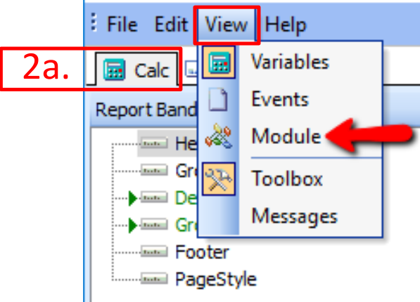

   2. Go **Event Handlers**

   3. Go **Procedure lbTaxAmtOnGetText(var Text:String);**

   4. Replace to this script:

    ```pascal
    var s : string;
    begin
        if (plSQL_0.GetFieldValue('TaxDate') < '01 Jun >2018') or
            VarToCurr(plSQL_1.GetFieldValue('TaxAmt')) <> 0) then

            s := 'GST Amt @ 6% ' else
            s := 'GST Amt @ 0% ';
        if plSQL_2.GetFieldValue('Code') &lt;> '----' >then
            Text := s + '(RM) :' else
            Text := s + ':';
    end;
    ```

   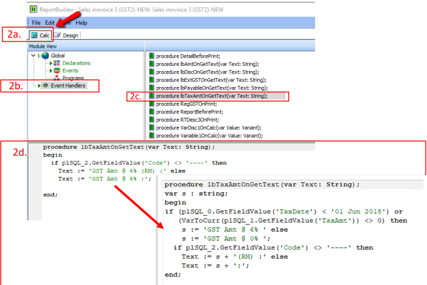

To Display Tax as 0.00 Instead of Blank:

   1. Click on your report name to enter into report designer page.

      

   2. Go to **Calc**, click on **View** and select **Events**

      

   3. Find **DBTxtTax**and select **OnGetText**, then paste the script as below:

       ```pascal
       begin
           if Trim(plSQL_1.GetFieldValue('TaxAmt')) = '' then
               Text := '0.00' ;
       end;
       ```

      

   Once you completed, save the report and exit, then you may preview again your format outcome.
