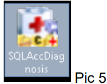
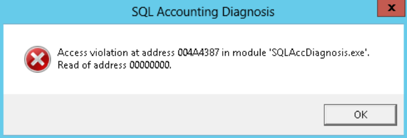
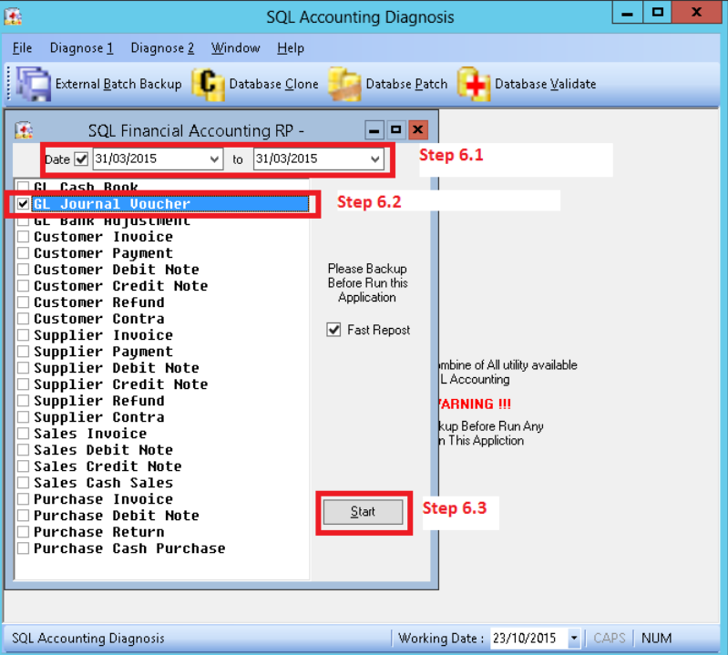

## Method 1

1. Drill down the document to check the source for this document. **(Refer Pic2)**

    

2. Drill down to Journal Entry, look for the Date 31/03/2015(Because Ledger Date is 31/03/15)

    

3. Press Edit and Save Button for all the Date is 31/03/2015.

4. After Edit and Save, apply the Ledger to see the result. **(Refer Pic4)**

    

5. Done

## Method 2

:::danger
Only to use if have a lot of transaction need Edit and Save.
:::

1. Download &lt;SQL Accounting Diagnosis> from [here](http://www.sql.com.my/utility) , After download, please install.

2. You can see on desktop there is new icon &lt;SQLAcc Diagnosis> , activate it.**(Refer Pic 5)**

    

3. Must Logon ONLY the **problem Database**, no matter in server or workstation also can run.

4. In SQLAcc Diagnosis | Menu Bar - Diagnosis 2 | Click on Reposting **(Refer Pic6)**

    

5. When error prompt, press ok will do. **(Refer Pic7)**

    

6. Set the Date Range and choose which Area to Repost. **(Refer Pic8)**

    

7. Press OK when repost Done.

    

8. Apply the Ledger to see the result.

9. Done
