SQL Account provides users with the option to backup their database into their local computer or a cloud drive storage. Users can perform backups as frequently as daily or weekly and have full ownership over their backups, allowing them to restore them at any time without additional charges.

## Why must I backup my database?

In any situation, it is always useful to have a backup copy of your work. Regularly backing up your SQL Account data is beneficial for several reasons:

1. Faster data recovery in emergency situations

2. Ability to perform cross checking and comparisons with past data

3. Protection against ransomware attacks and cyber crimes

4. Easy and secure sharing of data within the company

## Local Backup

### Backup

1. Go to **File** > **Backup Database**

   

2. Click on the "**+**" icon | select "**Add Local Storage**" (You may select multiple storage locations.)

   

3. Choose where you want to save your backup file

   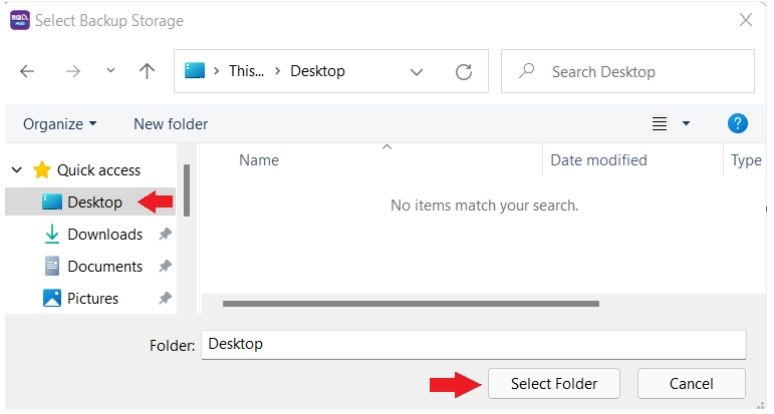

4. Click **Backup**

   **Compress Backup File** : This option will put the backup file into a ZIP file.

   **Best Compression Mode** : Takes longer time than normal backup, but the file size will be smaller.

   

5. Once the backup is completed, "Done" will be displayed. Press **OK**.

   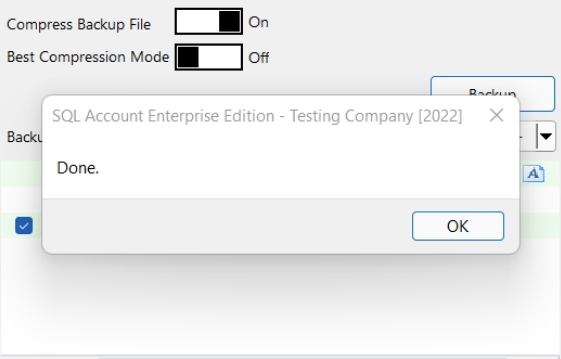

6. You will see a zip file in the location you have selected.

   

### Restore

1. Press the ⚙️ button at the bottom right.

   

2. Click **Restore…**

   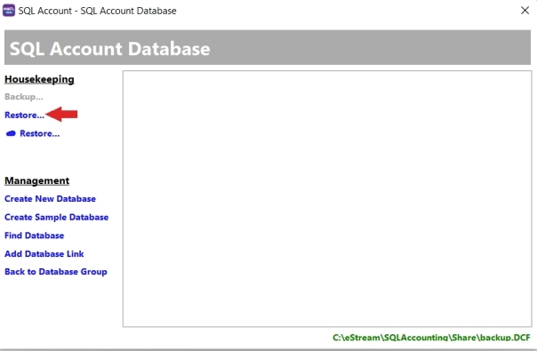

3. Click **…** button.

   

4. Look for your Backup File and click **Open**.

   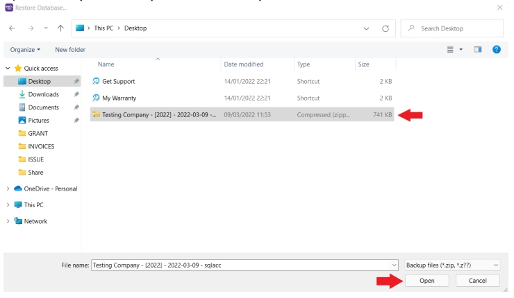

5. Click **OK** once backup file is selected.

   

6. Click **OK**

   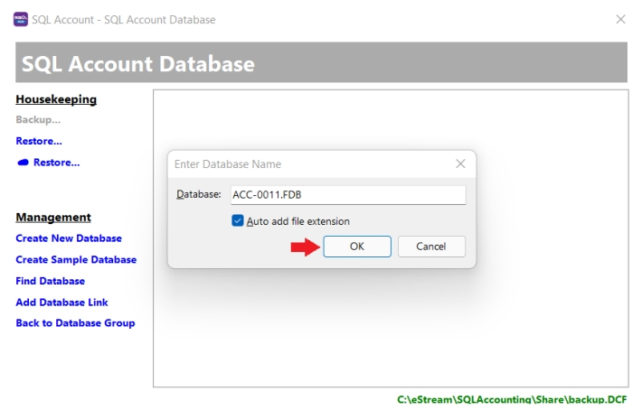

7. Once the restore is completed, **Completed** will be displayed. Press **OK**.

   

8. Your file is now restored. Double-click and login as usual.

   

## SQL AI Cloud Backup

What is AI Cloud Backup? AI Cloud backup is one of SQL’s latest services that gives users the option to store backups in a secure and regulated cloud-based server. Users can perform database backups and restore them anytime and anywhere.

### Benefits

1. Secure and encrypted storage.

2. Regulated security practices with frequent ransomware screening and server health analysis.

3. Backup and restore anytime, anywhere.

4. Ai Smart Recycle feature – removes older daily backups to utilizes cloud storage space.

### Cloud Backup

:::info[Requirement]
Please contact your SQL Agent to register a SQL Drive account beforehand.
:::

1. Go to **File** > **Backup Database**

   

2. Click on "**+**" and **Add Cloud Storage**

   

3. Click on **Login** > **Login with Google** > Type in your email address and password > **Grant access**

   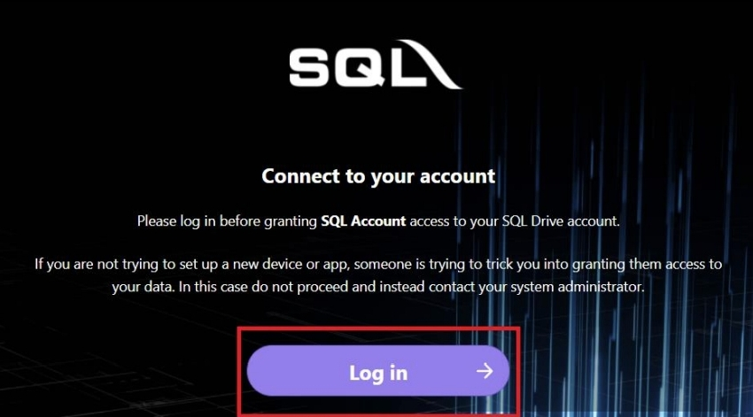

   

   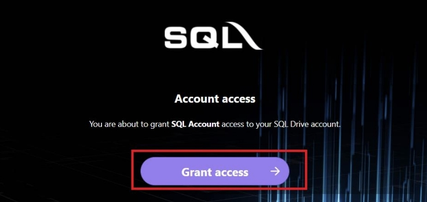

4. Click **Backup**

   **Compress Backup File** : This option will put the backup file into a ZIP file.

   **Best Compression Mode** : Takes longer time than normal backup, but the file size will be smaller.

   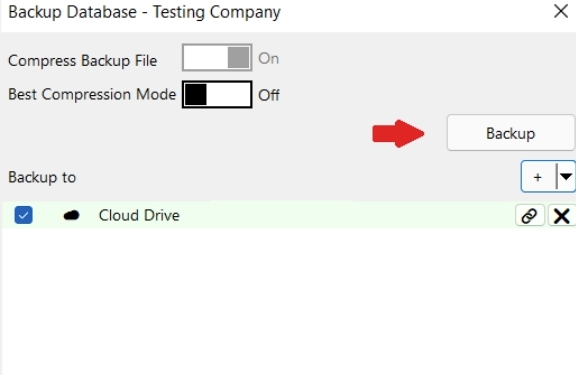

5. Once the backup is completed, **Done** will be displayed. Press **OK**.

   

### Cloud Restore

1. Press the ⚙️ button at bottom right

   

2. Click **Restore…** (with Cloud icon)

   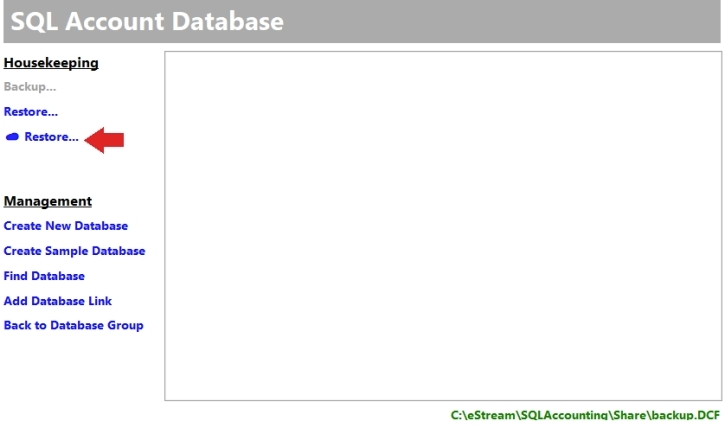

3. Select your Backup File and click **OK**

   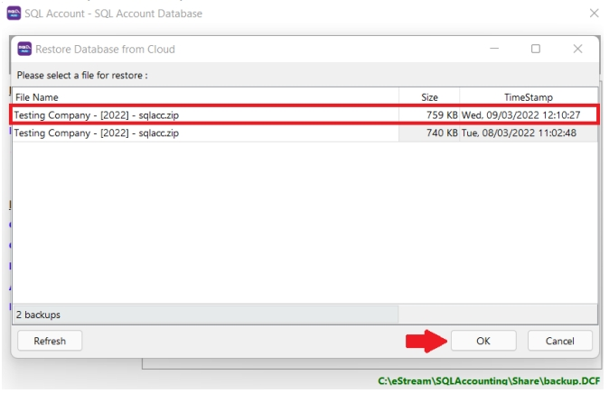

4. Click **OK**

   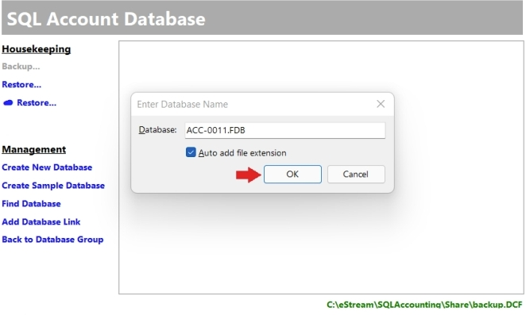

5. Once the restore is completed, **Completed** will be displayed. Press **OK**.

   

6. Your file is now restored. Double-click and login as usual.

   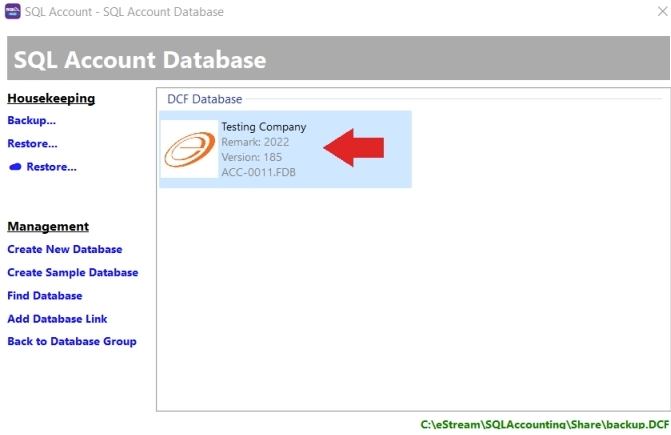
