## Maintain Cloud Account

1. Select ** > Maintain Cloud Account** (One Time Setting)

    

2. Click on NEW

    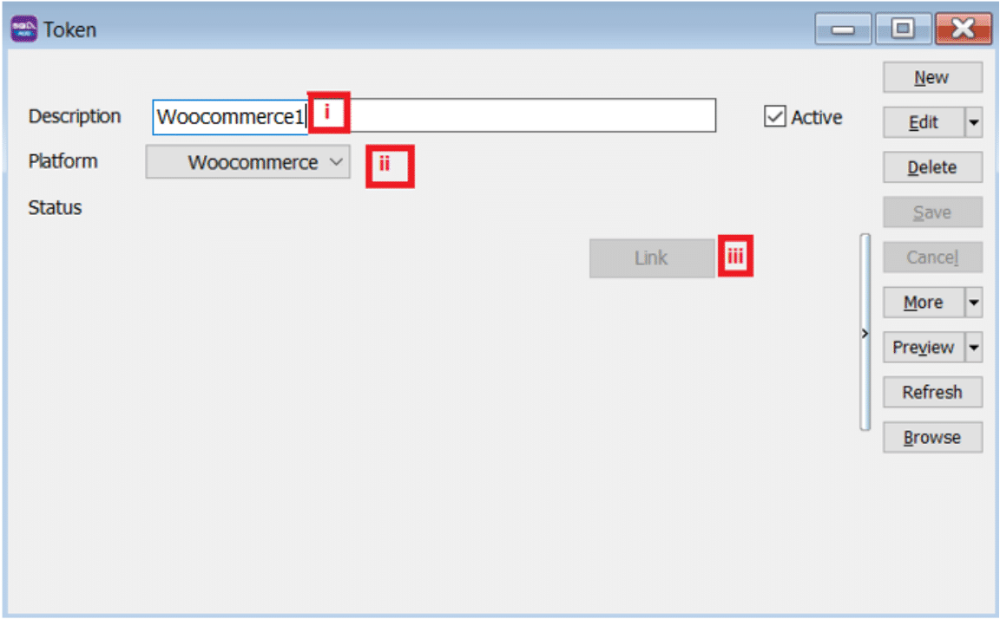

    1. Enter **Description**

    2. Select **Platform**

    3. Click on **Link** Button

        

    4. Enter store URL

        

    5. Go to your shop website and copy this first part of the URL:

        

    6. Paste in you SQL Account and press GO

        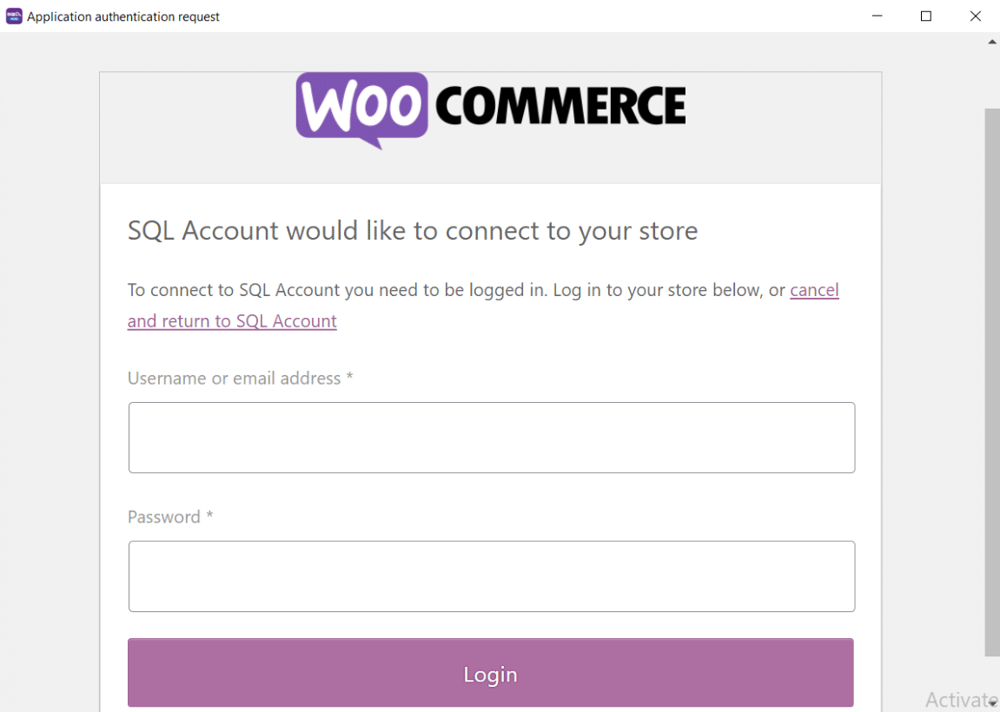

    7. Login to your Woocommerce account.

3. Press on SAVE

    

    - Once linking Successful, system will be returned status Linking Success Message.

## Configure E Commerce Setting

1. GL > Maintain Account

   1. Create Voucher / Discount Account Under Sales Adjustment

       

   2. Create Shipping and Transaction Fee under Expenses

       

       - It is up to company want to create under which category. Some of the Company will create under Cost of Goods Sold.

2. Customer > Maintain Customer

   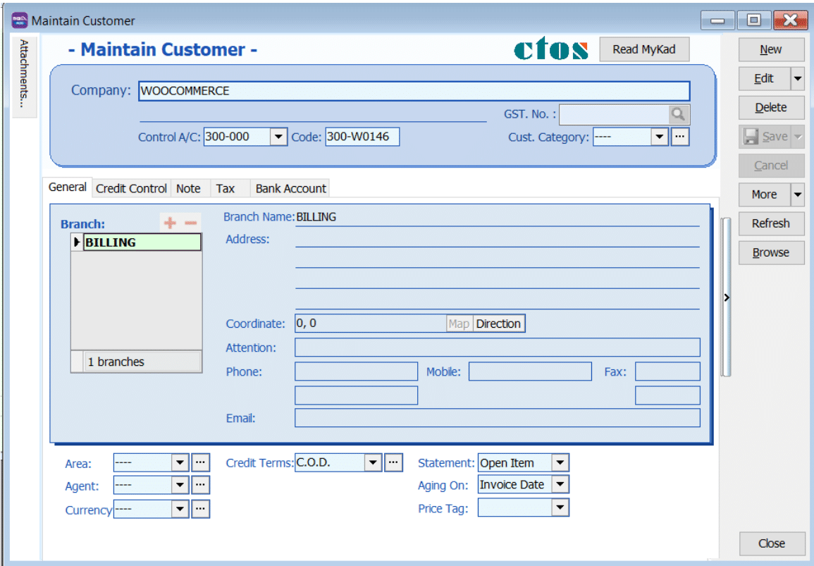

3. Stock > Maintain Stock Group

   Create Shipping / Transaction / Voucher / Discount Stock Group

   1. Create Discount Stock Group

       

   2. Create Voucher Stock Group

       

       - Repeat same step to create for Shipping, Transaction Fees and Claim Stock Group

4. Stock > Stock Item

   1. Create Discount Stock Item

       

   2. Create Voucher Item Code

       

       - Repeat same step to create for Shipping, Transaction Fees and Claim Item Code

## Account Tab

 1. Click on  - > Woocommerce

 2. Click on Account Tab > Double click on your account

     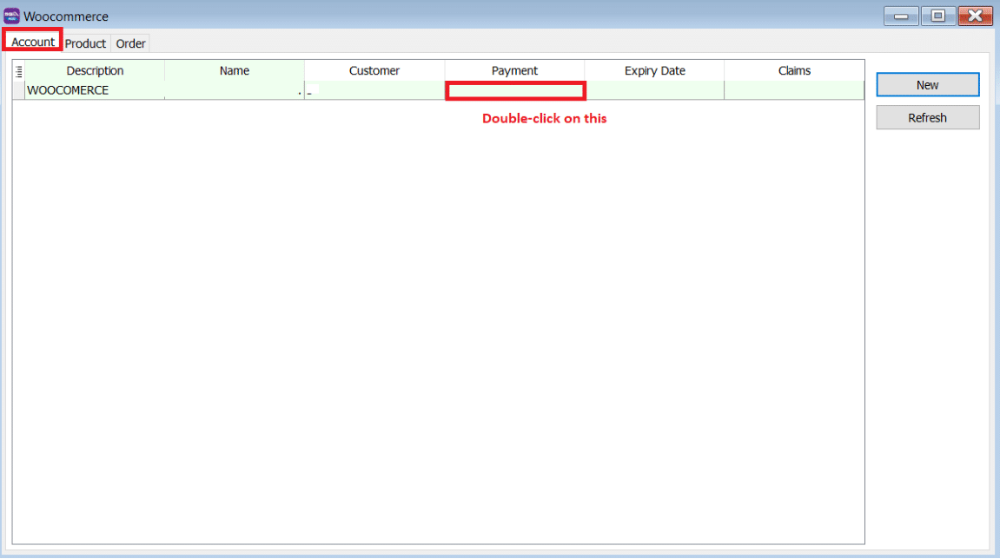

     1. Mapping Code

         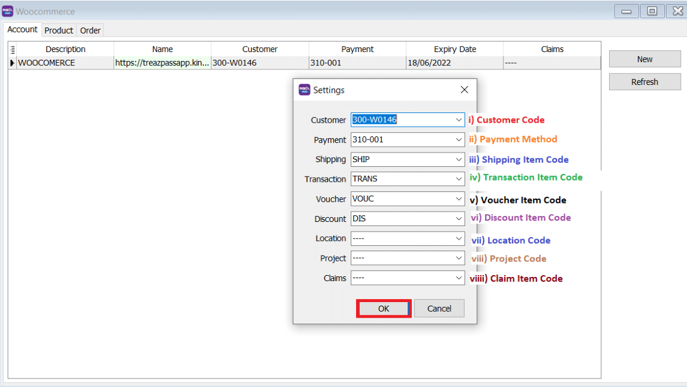

     2. Expiry Date

         - Is the linking expired with both parties given by Woocommerce platform for
         security policy, once expired must relink with Woocommerce account to fetch
         the order.

## Product Tab

 1. Step to download Product list from WooCommerce

     1. Click on “Products” Tab, then click on “All Products”

         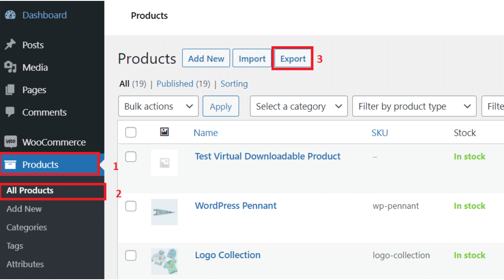

     2. Click on the “Export” button

         

     3. Click “Generate CSV” once the export file has been generated. You will receive a file in .csv format.

         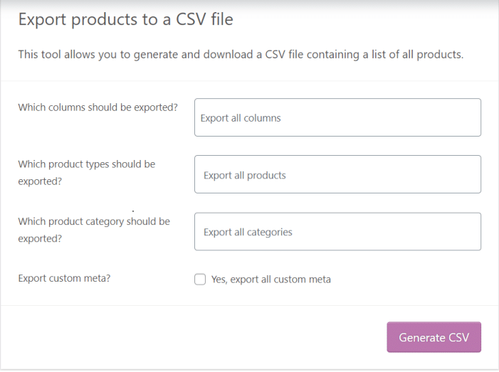

     4. Load the file into Microsoft Office. Then you can edit the details you need.

         - You can choose to have WooCommerce SKU as SQL Item Code by import to SQL, may contact your service agent to assist on this product import.

 2. Fetch Product

     1. Click on Product Tab > Click on Fetch Button > System will return the message when fetching done.

         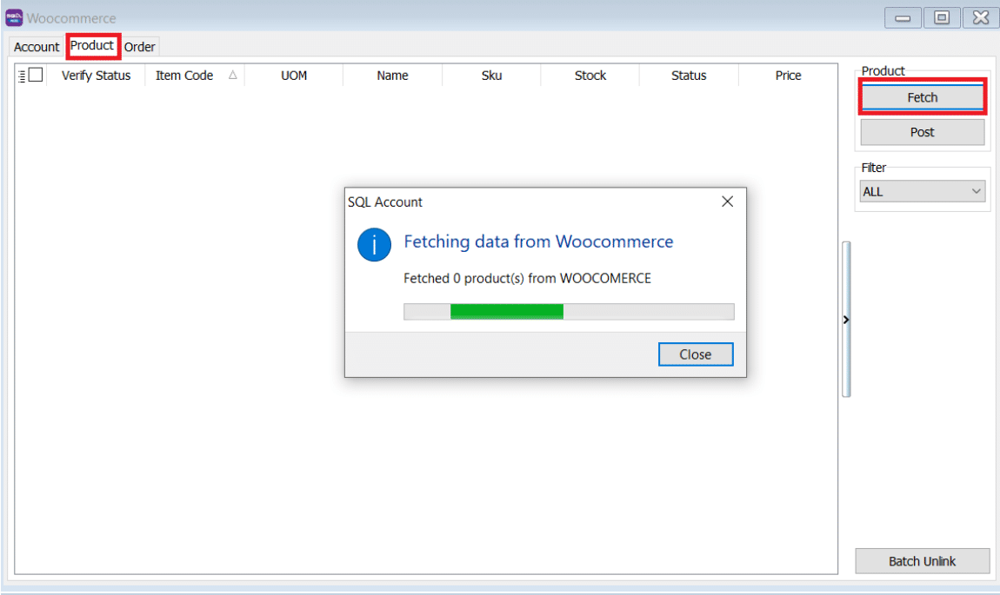

         

     2. Verify Status: Exist in Stock Item are meaning SQL and Seller SKU are having the same Item Code.

         

         If you decide to use the same item code as Seller SKU, click on select All records > press on Post button for the first time so system will remember the settings.

         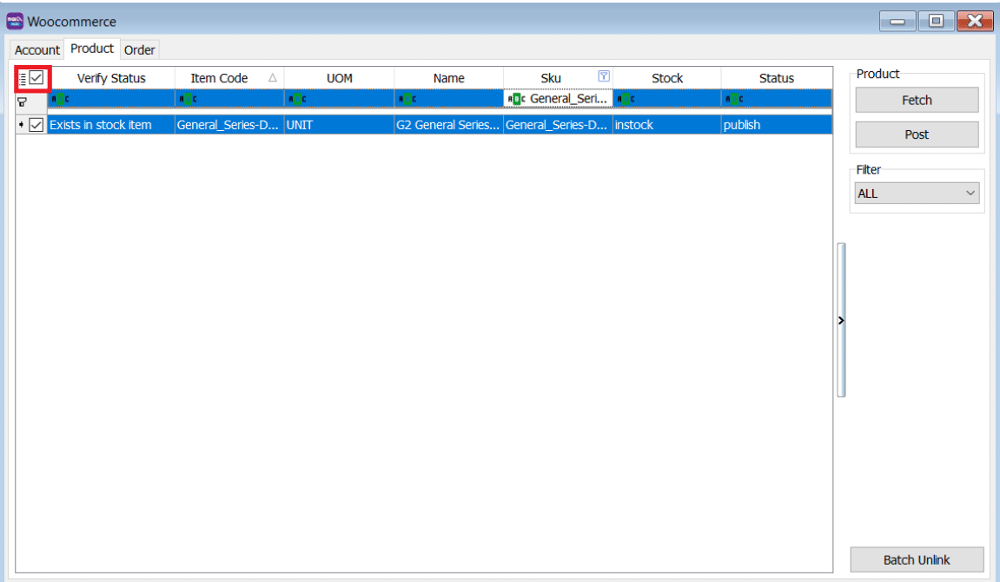

     3. Verified Status: Success when posting done

         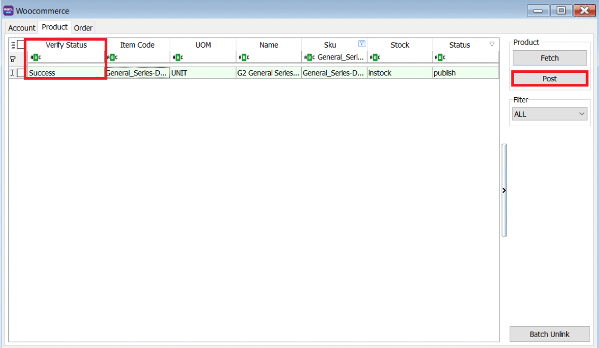

         :::note
         Once you post successful, system will keep the Shop SKU in Stock Item as Alternative Item
         :::

         

     4. You can still decide to map to different item code (system will auto ticked the record you change the item code), once done all, click on POST button.

         

## Orders Tab

1. Click on Orders Tab

     

2. Status

     

     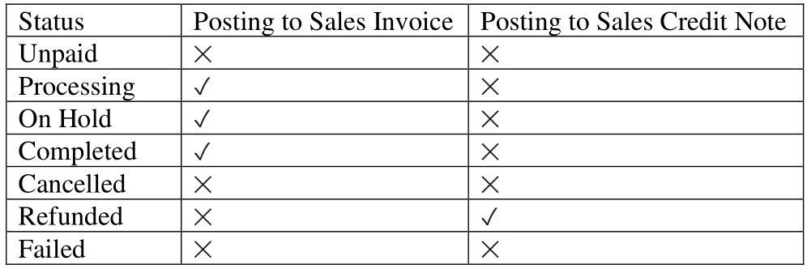

     :::tip
     Each order number will be posted once. You can delete the Invoice if you want to repost.
     :::

3. Fetch Order

     1. Select Date Range > Click on Refresh Order

         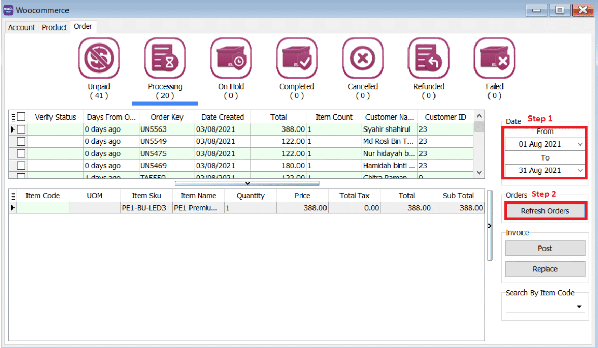

         Please be patient, system is on the way to fetch the order from WooCommerce

         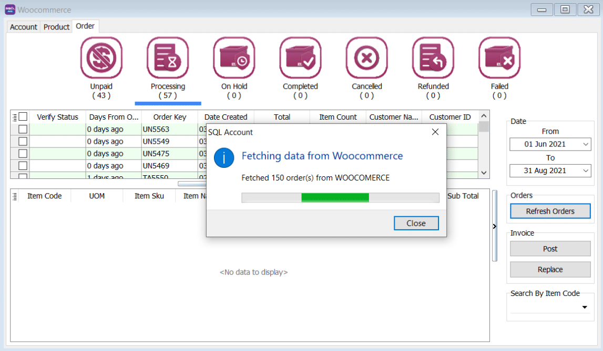

         System will return the message when Fetching Done, Press OK.

         

4. Post Order

     1. Click on the status you want to post the order, let us take an example on Completed - > Ticked all > Click on Post

         

     2. If you did not tick on any order when do the posting, system will raise a message: You have not selected any order. Would you like to select all? If you would like to post all > Press Yes

         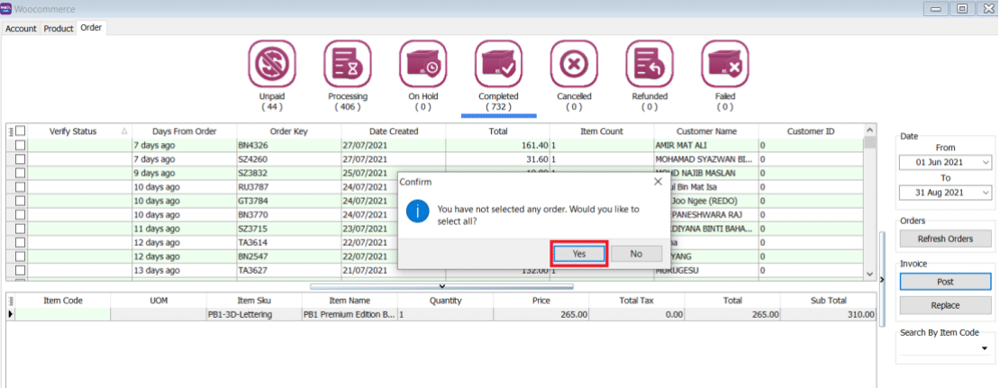

         Please be patient to wait for the order posting.

         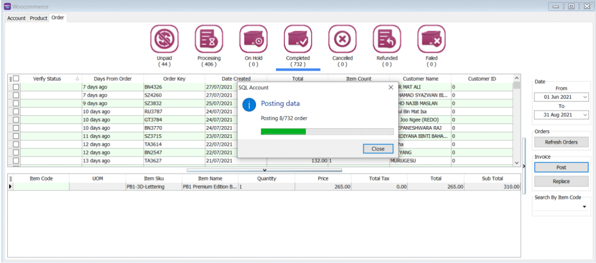

     3. Click on OK when done posting

         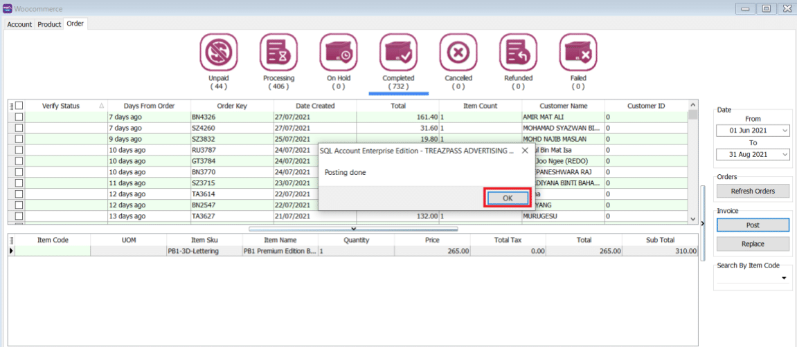

5. Verify Status

     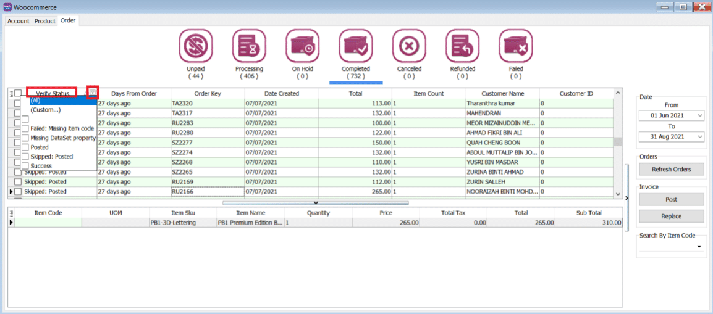

     1. Posted

         - Earlier Order posted before, system will ignore.

     2. Success

         - Order had been successfully Posting.

     3. Failed – Missing Dataset Property

         - Normally repost will be fine.

     4. Failed – Missing Item Code

         - Is due to WooCommerce have inactive item code, user can manually map in orders.

         1. Click on Item Code Drop Down, user can manually map the item code

             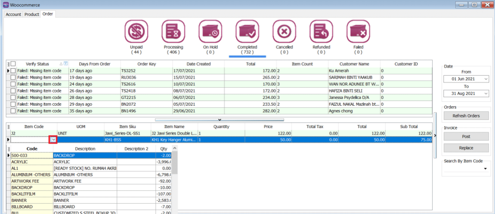

         2. Ticked on the record you want to post

         3. Click on Post

6. Sales Invoice

     - Example of Sales Invoice posted from WooCommerce | Orders.

         

         

         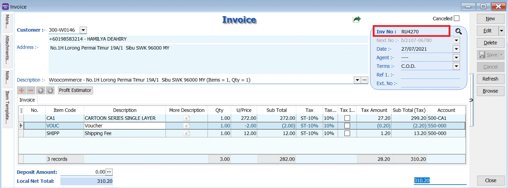

7. Sales Credit Note (Refund)

     - Refunds in WooCommerce are posted as sales credit notes in SQL Account.

     1. Example of Sales Credit Note posted from WooCommerce | Orders.

         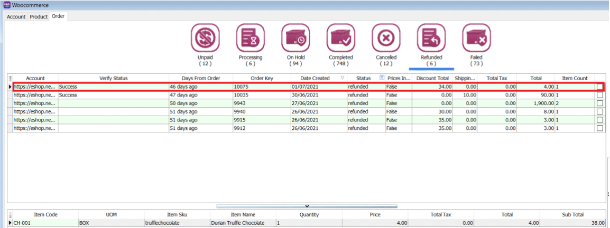

     2. Tick which orders key you want to post to sales credit note. If post is successful, the verify status should show “Success”. You can see a Sales credit Note has been created in Sales | Credit Note

         

     3. For a refund voucher, a sales credit note will be created as well as a sales invoice.

         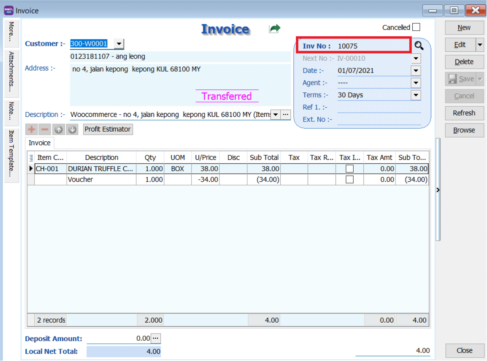

         

     4. In the customer credit note, The CN knocks off the outstanding amount of the Invoice.

     5. Meaning the invoice has been cancelled off and there is not outstanding payment.
