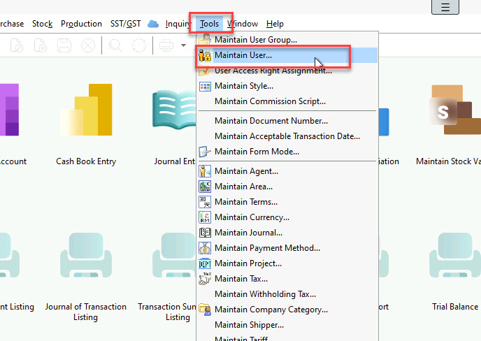
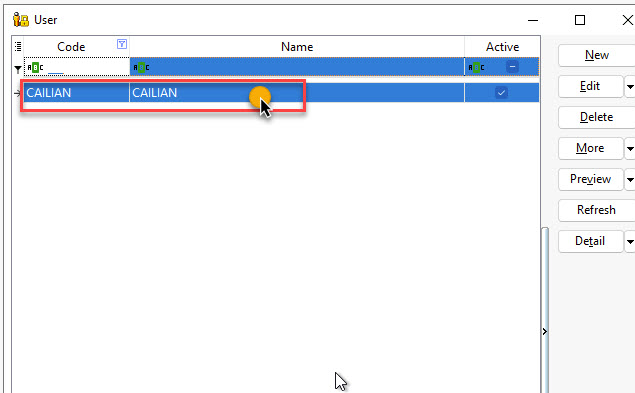
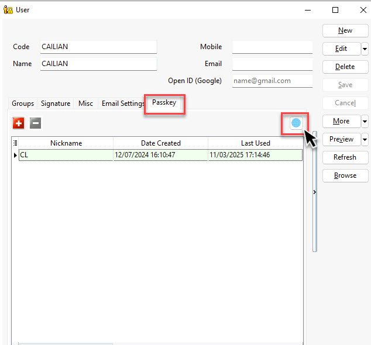
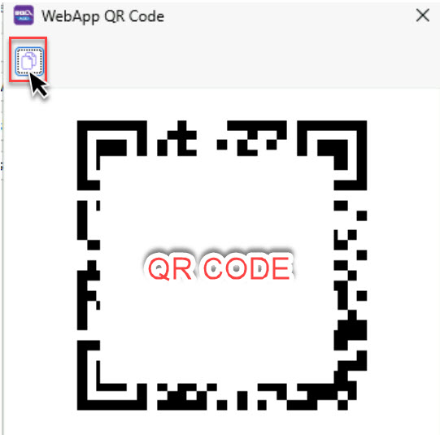
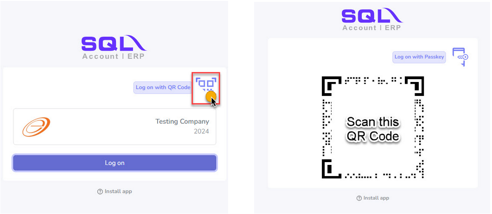
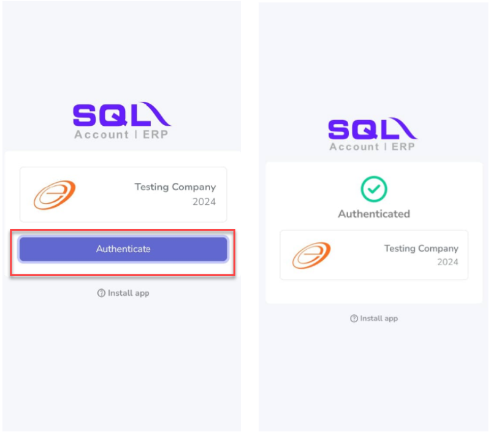
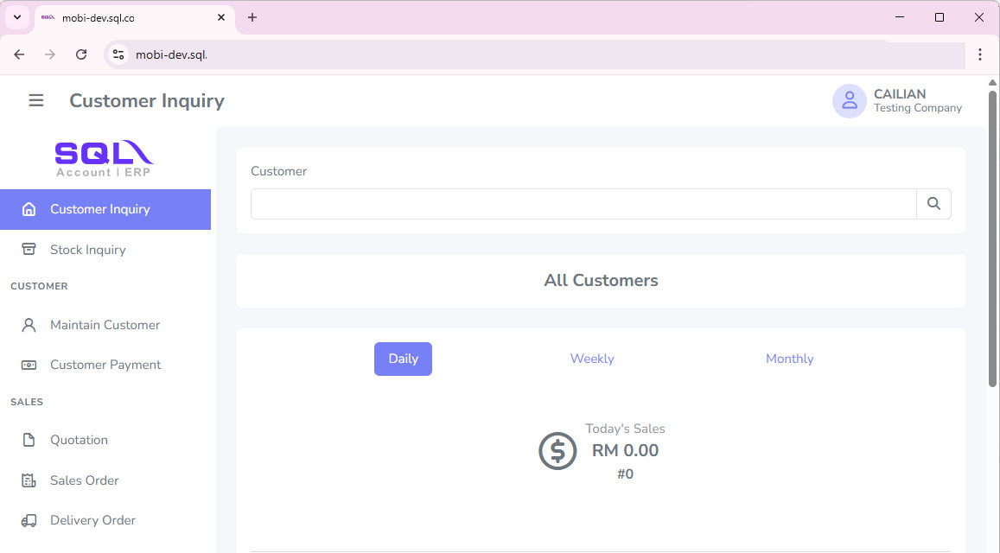

## 1.0 How to Use Mobile Connect in Web View

**Step 1**: Go to **Tools | Maintain User…**

**Step 2**: Selecting (Double click) the **User** for Mobile Connect in Web View 

:::info
The user has already registered passkey before.
::: 

Then, select the `Passkey` and click on the global icon

**Step 3**: Click this icon to copy the link and paste it into your browser.

**Step 4**: Click `Log on with QR Code`, then scan the QR code.

 

:::info
Make sure to use the device that registered the passkey for this user to scan the QR code.
:::

**Step 5**: Proceed by opening it in the browser on your device. Next, select `Authenticate` and approve the access.

 

**Step 6**: You can now use Mobile Connect in Web View. 

