## 1. Maintain Stock Item

- Item Code must be 7 Character(Cannot more and less)
- First 2 Characters of Item Code must Fix, mostly use 88 or 99
- Remaining 5 digit is Item Code Running Number

    Example:

    1. Item Code = 8800010, all others item code with measure scale have to start with 88xxxxx

    2. UOM Must be KG or PCS

    3. Enter Ref Price

    4. Save

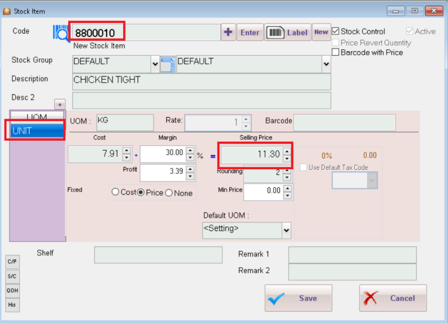

:::note
You are recommend to create all the item code first
:::

## 2. IN SQL POS Setting

1. Others Tab

2. Scale Barcode Set to Price

    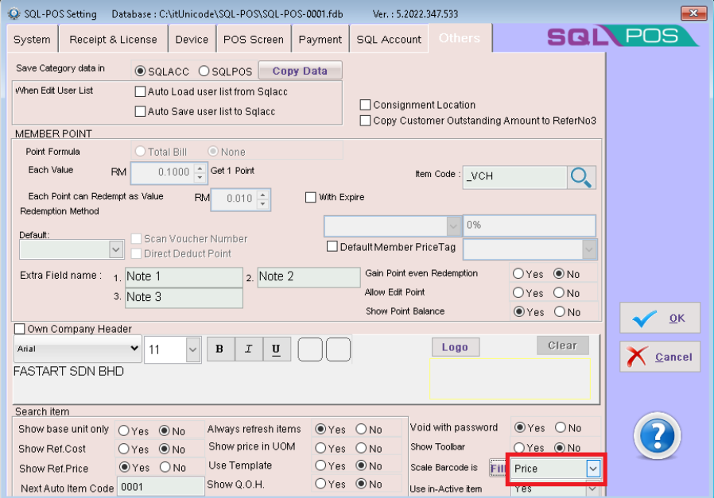

3. Click on Fill

    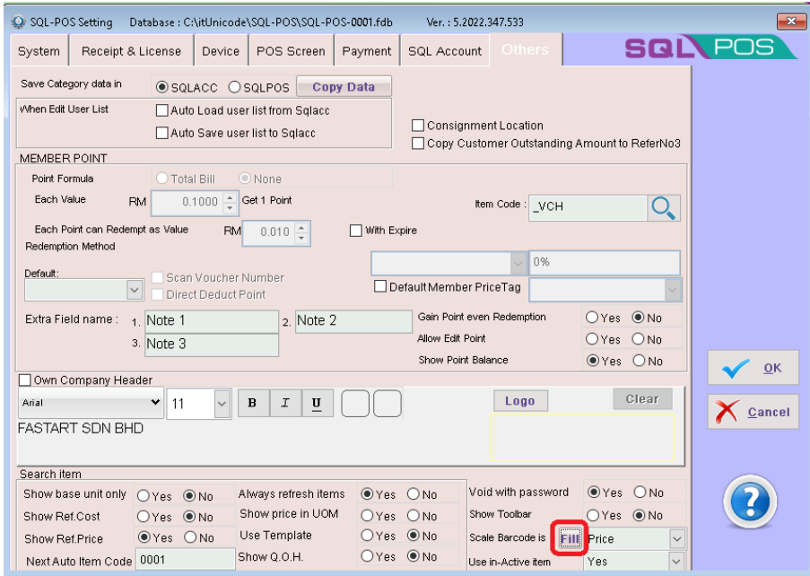

4. Fill Scale Items

    - Department = First 2 Character of Item Code
    - Code Length = 7 Digit Characters
    - Ticked Barcode with Price
    - Ticked Price Revert Quantity
    - Click on button Fill items which are Match

    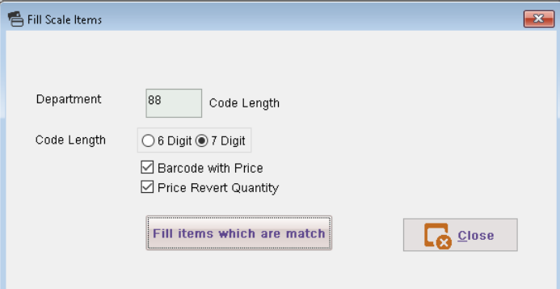

5. Click on Yes

    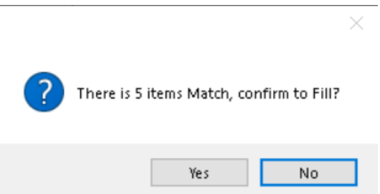

6. Click on OK

    

7. Close & Save the Setting

    :::caution
    **Every time you have added NEW with item code, you have to repeat for Step no 2**
    :::

    In Stock Item, for the items have fulfil the criteria will auto ticked with Price Revert Quantity and Barcode with Price.

    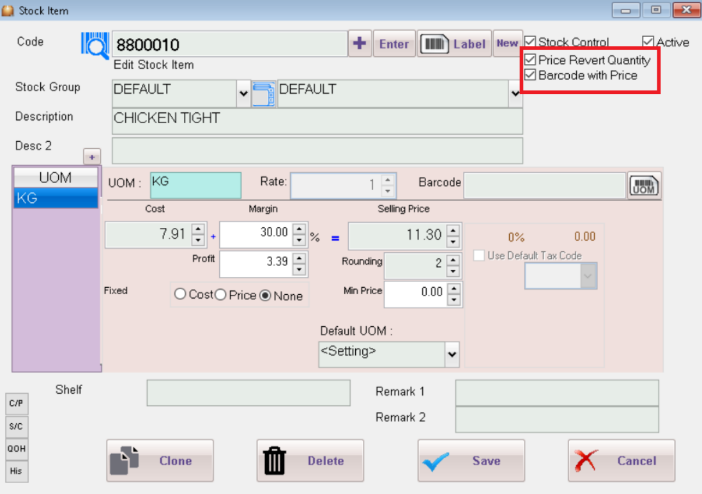

## 3. Step to update Price to weighing scale

1. Stock Item | Right click on More | Select Export to Scale Machine

    

2. Here is the model able to support by SQL POS

    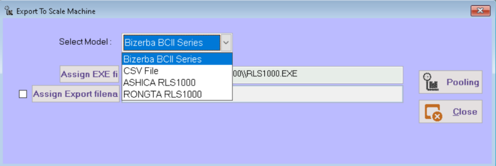

3. Select Model | Tick Assign Export FileName

    - Assign Export FileName = C:\ITUnicode\PLU.TXP

    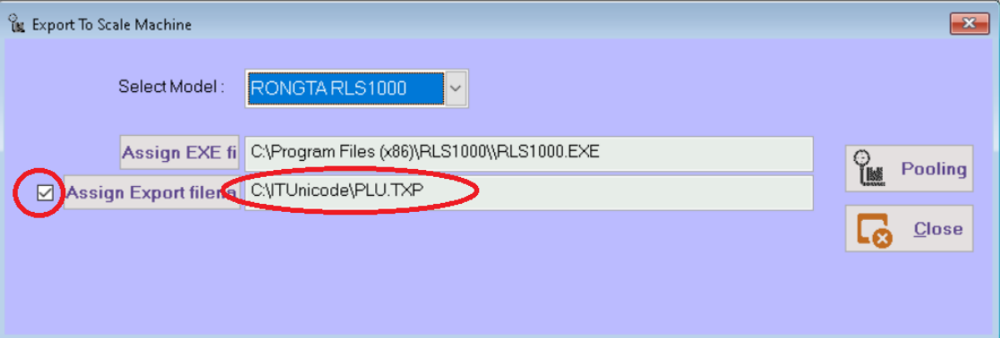

4. Click Button Pooling.

    - System will run the program C:\Program Files\RLS100\RLS1000.EXE **(Please make sure RONGTA Pooling program is installed)**

5. System will auto open RLS1000 Program

    

6. File | FSetting

    

    - Set Exported folder C:\ITUnicode\
    - Directory of Work : C:\ITUnicode\

    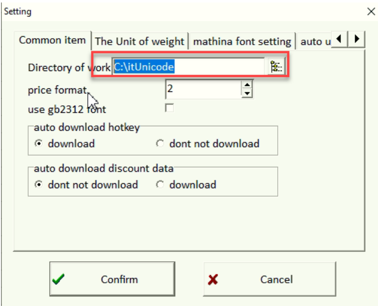

7. Click on Confirm

8. Setting for RLS1000

    - Department Name = Scale 1
    - Scale Name = Scale 1
    - Scale IP = 192.168.0.x

    :::info
    You can use CMD to ping with the Scale IP Add, make sure able to ping
    successfully first
    :::

    - Plu_file = PLU.TXP

    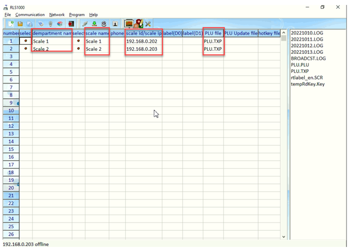

    :::note
    Above example is 2 weighing scale
    :::

9. Click Green arrow button to Pooling latest selling price into scale Machine.

    

10. Click confirm.

    

11. Status mention OK mean is connected

    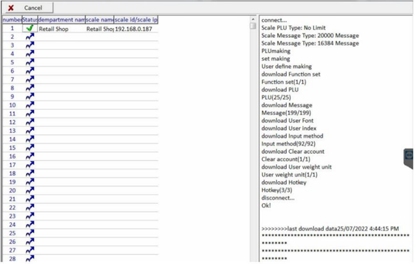

    :::note
    **After setting for first time, when there is the price to update to weighing scale, you just have to refer to Step 3.1 & 3.4 & 3.9 & 3.10**
    :::

Now you can test to Scan the barcode in POS, check system able to capture the correct price and Qty?

If everything’s is correct, then will be fine.

:::info
Testing on weighing scale

- If item code is 8800010, then number 10 represent this item, in weighing scale
Keypad, press 1 & 0, to measure, label will print out automatically.
- If print out label is empty(weighing scale have the item description), mostly is headline problem, need to refer back to Scale vendor.

:::
