## 1. Register for Peppol

1. Go to **File**

2. Click on **Company Profile**

    

3. Click on **Peppol Tab**

4. Click on **Register As Peppol User** to register your own company Peppol ID

    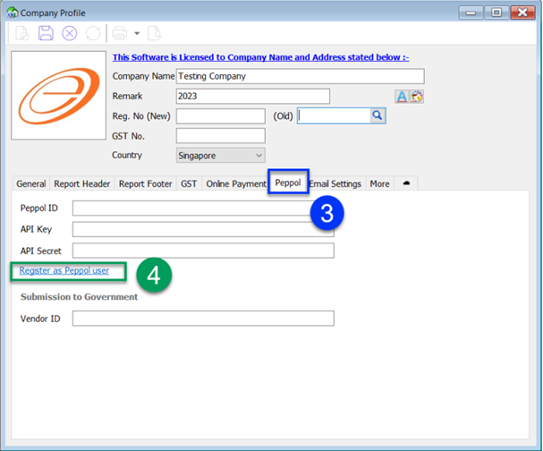

5. It will be directed to our website to **complete the required details**

    Upon successful registration, user will receive notification email from Datapost within 1 to 3 working days.

    Once registered , your company Peppol ID will be listed in [Singapore Peppol Directory](https://www.peppoldirectory.sg/)

    

:::info Note
**Please note that obtaining the API Key and API Secret will incur additional charges**
:::

## 2. Setting Peppol In Company Profile

### 2.1 B2C (Business To Customer)

1. Once received, key your **Peppol ID , API Key and API Secret** in Peppol Tab

    *(API key and API Secret can be found in your Peppol online portal)*

2. Fill in your company **UEN Number in Reg.No (New)**

3. **Save**

    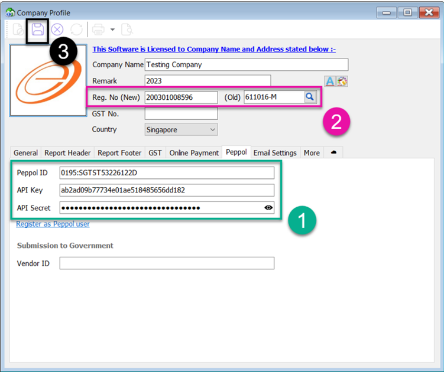

### 2.2 B2G (Business To Government)

1. Fill in your **Vendor ID** registered on Vendors@Gov

2. **Save**

    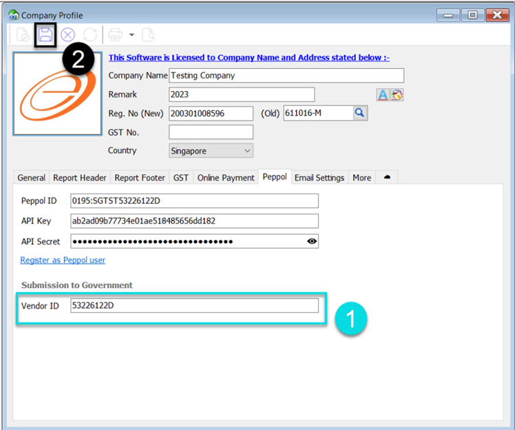

## 3. Maintain Customer & Supplier Peppol ID

1. Go to Customer

2. Click on Maintain Customer > Double Click your customer

    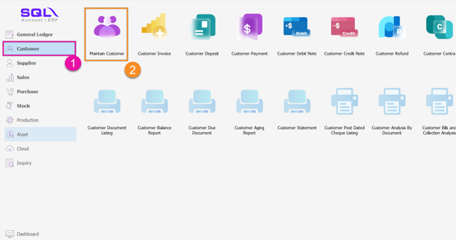

### 3.1 Peppol B2C (Business To Customer)

1. Click on **Edit**

2. Select **Note Tab**

3. Click on the **‘magnifier’ button** to search customer peppol ID

4. Select the Customer **Company Name to get Peppol ID**

    *(When you input your Peppol details, the system will automatically update your UEN Number. Please double check to ensure its accuracy)*

5. Fill in customer **UEN number in ‘Reg. No (New)**

6. Click **Save**

    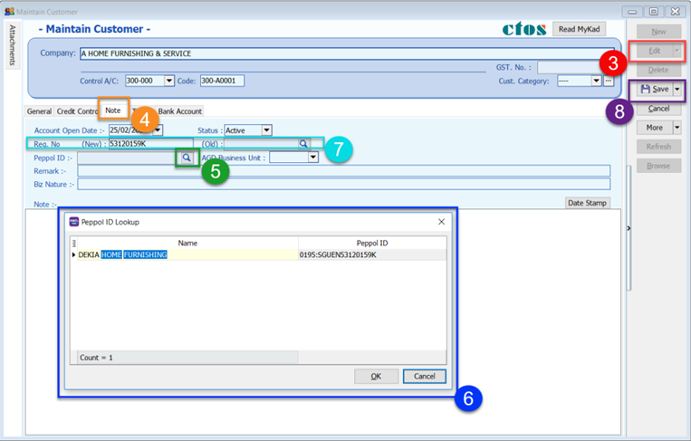

### 3.2 Peppol B2G (Business To Government)

1. **Peppol ID must be : 0195:SGUENT08GA0028A**

2. Must fill in your customer **Business Unit**

    *Please enquire with your client agency to get accurate Business Unit to indicate*

3. If the Business Unit given from your client agency is not listed, please type it manually and click on the blue text

    For Example : IMDA1 not listed , click the **IMDA1**

    

    :::info For Supplier
    Go to Supplier > Maintain Supplier > Edit > Note Tab
    :::

## 4. Send Sales Document from SQL Account

### 4.1 Send Document by B2C (Business To Customer)

1. Once the sales invoice / Sales Credit Note is prepared, Click **Send button** to send your document to Peppol.

    *Make sure the Peppol ID and UEN Number had filled in correctly in Maintain Customer*

    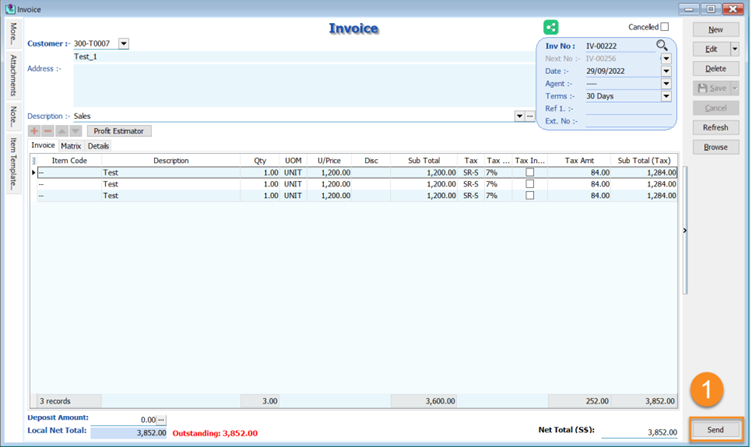

### 4.2 Send Document by B2G (Business To Government)

B2G follows the same steps as B2C, but B2G's Peppol ID must be **0195:SGUENT08GA0028A (refer Topic 11.3.2)**. Additionally, there are additional validations for B2G transactions.

## 5. Item Code Mapping

:::info
Item codes for items in the Peppol document will be automatically selected if there is a matching description.
:::

1. Click **Stock**

2. Click on **Maintain Stock Item**

    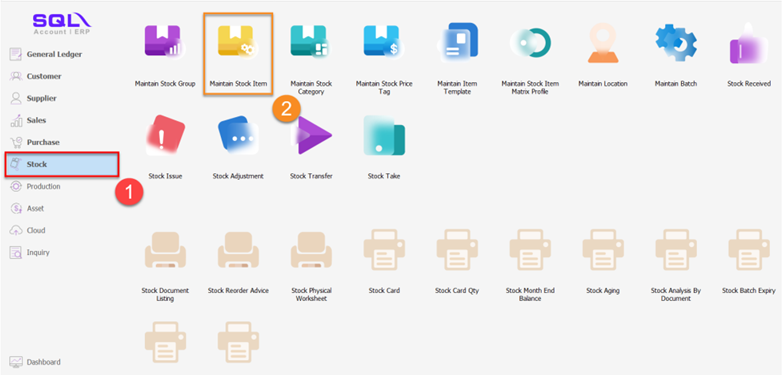

3. Click **Edit**

4. Click on **Supp. Item tab**

5. Click ‘+’ button

6. Fill in your **supplier code and description**

7. **Save**

    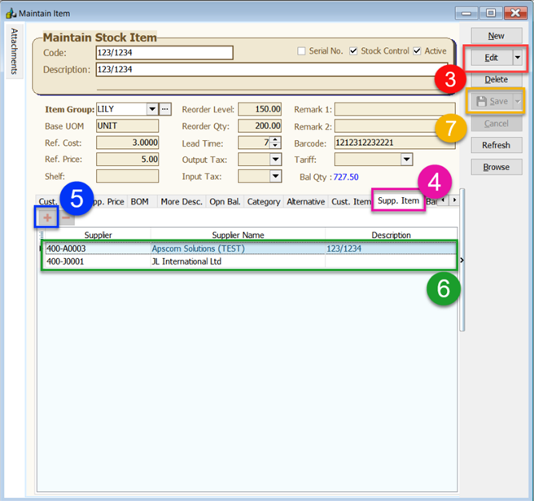

After done settings, when you import a document from Peppol, the items will be automatically mapped item code and displayed as shown in the picture below, as an example:

    **1. Supplier Code and Supplier Name matched**

    **2. Item Description matched**

    **3. Item Code set automatically**

:::tip
You can manually map item codes during the invoice import process even if you not follow this step to map item code
:::

## 6. Import Purchase Document into SQL Account

1. Purchase

2. Peppol Import

    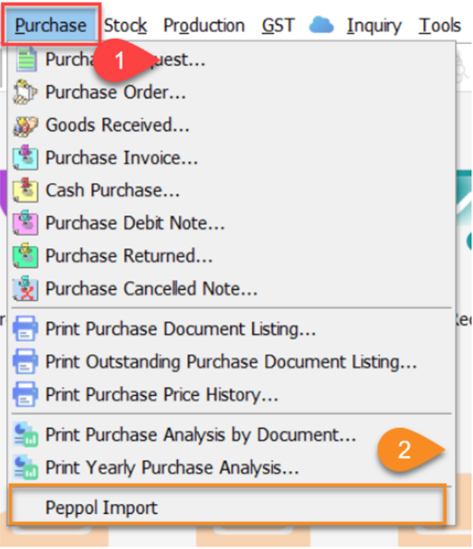

3. Select date range and click Apply

4. Tick the checkboxes to select documents to import

5. Click Import button

    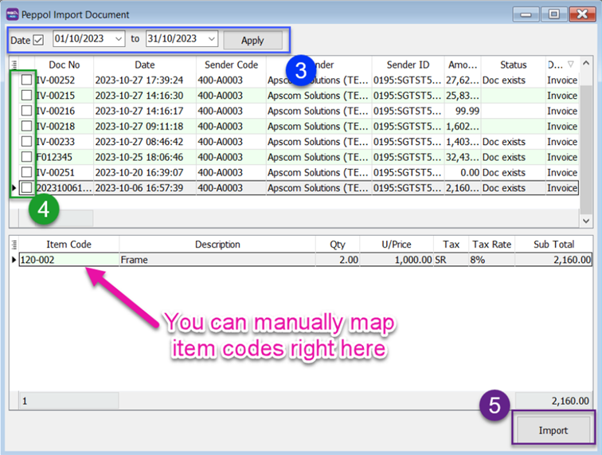

6. A pop up message will show for **Posting Done**

    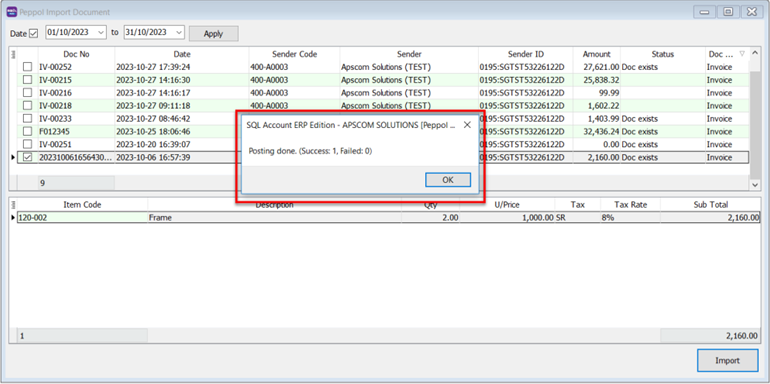

## 7. List Of Status

## 8. Error code and Message

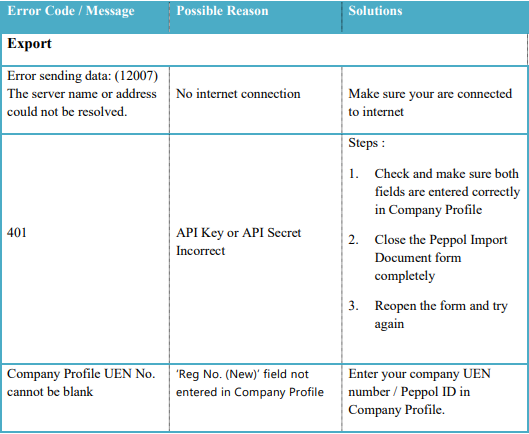

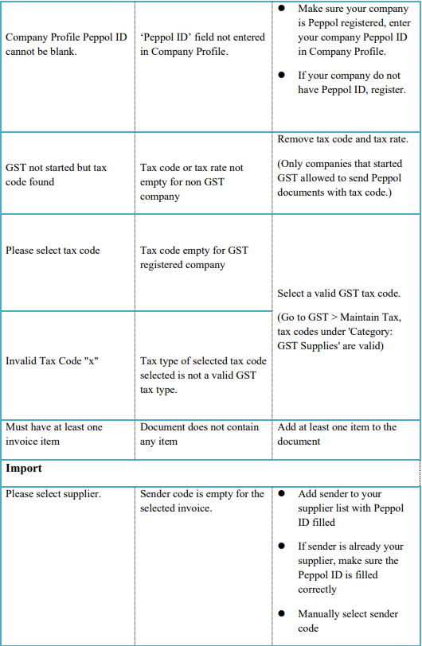
