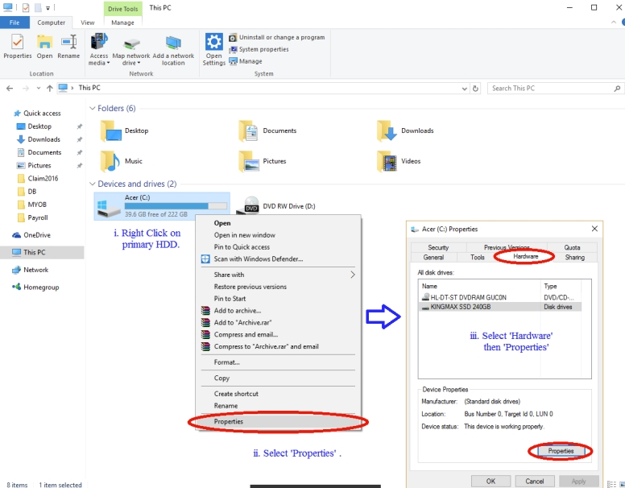
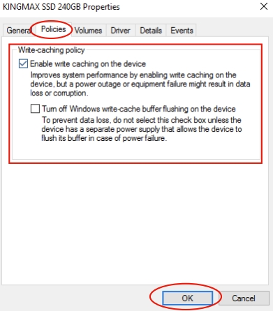
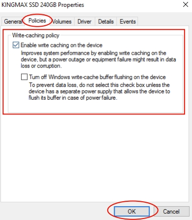

## Solution A (not recommended)

1. Right click on the primary Hard Disc (eg. C:\), click to Properties\Hardware \Properties.

   

2. Go to ‘Policies’ tab.

3. Turn-ON ‘Enable write caching on the device’.

   Untick the ‘Turn off Windows write-cache buffer flushing on the device’.

4. Press OK to EXIT.

   

## Solution B (Recommended)

   1. Add Physically new partition/ Hard Disc (let’s said G:\). Ensure the all FDB files stored in G:\ .

   2. Right click on the partition/ Hard Disc (eg. G:\), click the Properties\Hardware \Properties.

   3. Go to ‘Policies’ tab.

   4. Turn-ON ‘Enable write caching on the device’.

      Untick the ‘Turn off Windows write-cache buffer flushing on the device’.

   5. Press OK to EXIT.

   
