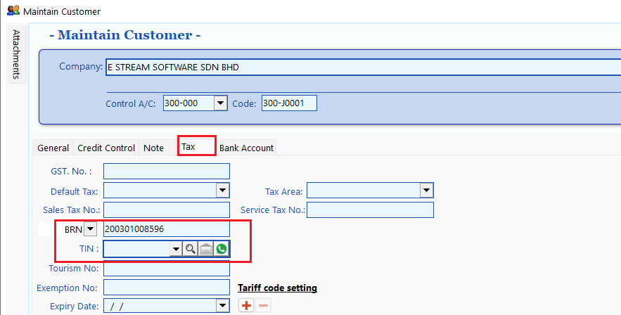
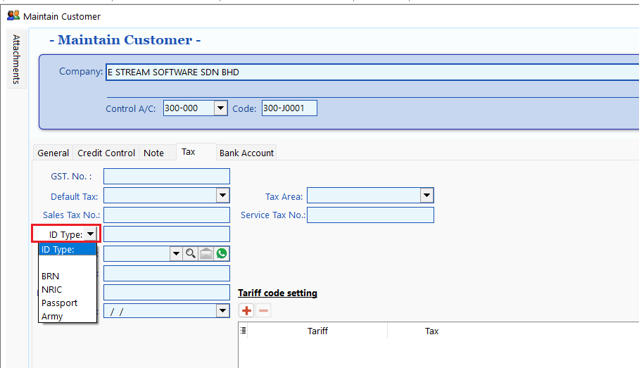
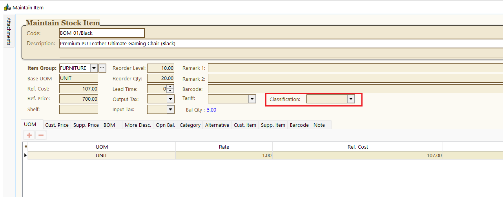
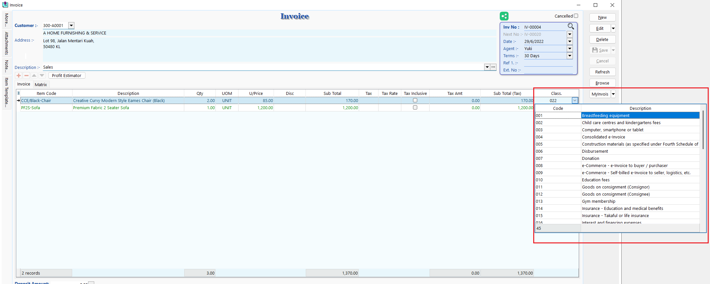

Before issuing an e-Invoice, you will need to make sure some mandatory fields is updated correctly.

## Update Customer Info

1. Go to **Customer** > **Maintain Customer** > **New** or **Edit** an existing customer.
2. Fill in the mandatory fields as shown below.

    

3. Click on **Tax** tab, and fill in customer tax info according to the guide in next section.

### Local Business (Companies registered with local authorities)

If you customers are a registered entity in Malaysia (e.g.: SSM registered), you must fill in the BRN & TIN of the customer in order to issue e-Invoice to the buyer.

    

### Individual / Foreign Buyer

In facilitating a more efficient e-Invoice issuance process as well as to ease the burden of individuals in providing their Tax Identification Number (TIN) and identification number details, IRBM provides the following concession to individuals:

1. For Malaysian Individuals to provider either:
   1. TIN only
   2. MyKad / MyTentera identification number only
   3. Both TIN and MyKad / MyTentera identification number
2. For non-Malaysian individuals to provide either:
   1. TIN only (TIN assigned by IRBM or use General TIN **EI00000000020**)
   2. Both TIN and BRN of foreign company
   3. Both TIN and passport number / MyPR / MKAS identification number

For Malaysian Individuals:
|Scenario|In SQL Account|
|---|---|
|TIN only|**ID Type**: NRIC, **ID Value**: Leave Empty, **TIN**: Buyer TIN|
|MyKad only|**ID Type**: NRIC, **ID Value**: Buyer NRIC, **TIN**: General Public **EI00000000010** |
|Both TIN & MyKad|**ID Type**: NRIC, **ID Value**: Buyer NRIC, **TIN**: Buyer TIN|

For non-Malaysian Individuals:

|Scenario|In SQL Account|
|---|---|
|TIN only|**ID Type**: Passport, **ID Value**: Leave Empty, **TIN**: Buyer TIN or General TIN **EI00000000020**|
|Both TIN & BRN of Foreign Company|**ID Type**: BRN, **ID Value**: Buyer BRN, **TIN**: Buyer TIN or General TIN **EI00000000020**|
|Both TIN & Passport|**ID Type**: Passport, **ID Value**: Buyer Passport Number, **TIN**: Buyer TIN or General TIN **EI00000000020**|

**Reference:**

1. List of ID Type in Maintain Customer:

    

2. List of General TIN in Maintain Customer:

    

## Update Stock Item

IRBM (LHDN) has introduced [Classification Codes](https://sdk.myinvois.hasil.gov.my/codes/classification-codes/) to define the category of products or services being billed as a result of a commercial transaction.

1. Go to **Stock** > **Maintain Stock Item** > **Edit** stock
2. Update the classification accordingly.

    

3. Repeat Step 1-2 for all stocks.

:::info
You can also override the stock item classification codes during sales invoice entry.

:::
