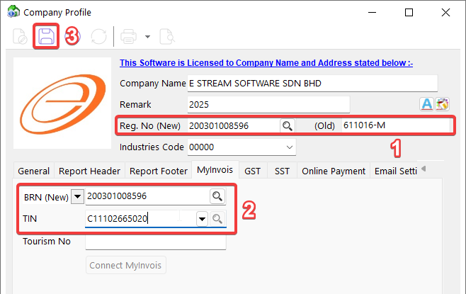
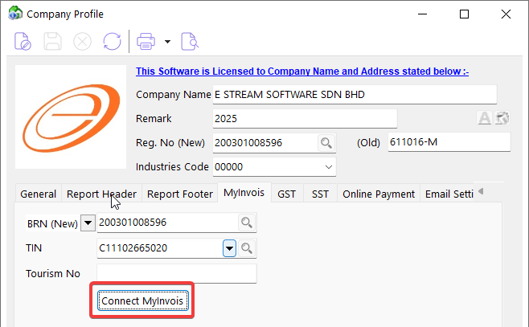

To streamline the e-invoice submission through SQL Account, you will need to go through a simple onboarding process.

## Company Profile Setup

### MyInvois Portal Linking

1. Go to **File** > **Company Profile**.
   1. Make sure your company registration number (BRN) is correctly filled in. (click on the magnifying glass to utilize our auto BRN lookup feature)
   2. Make sure the TIN number has been filled in correctly.
   3. Click on 💾 **Save**.

        

2. Click on **Connect MyInvois** to setup your **LHDN MyInvois** credential.

    

3. Login to MyInvois Portal on the right side.

    :::warning[IMPORTANT]
    To test E-Invoice, ensure the **I want to try on Sandbox Environment first** checkbox is checked. This lets you use the LHDN Preprod API for testing.

    When you're ready to switch to the production environment, return to this page, click **Go Live**, and follow the steps again.
    :::

    

4. Go to **MyInvois**

    

5. Click on top right, and go to Taxpayer Profile.

    

6. Scroll to the bottom and click on **Add Intermediary**.

    

7. Fill in the **TIN**, **BRN**, and **Name** using the provided info on the left.

    

8. Scroll down and click **Continue**.

    

9. Setup the **Representation From**, **Representantion To** (leave empty to avoid expiry), and make sure all permissions has been enabled.

    

10. Click on **Test Intermediary** and you shall see all permissions can be retrieved successfully.

    

11. Click on **Register ERP**.

    

12. Fill in the **ERP Name** & **Client Secret expiration** as below:

    

13. Click on the copy button in sequence as shown below and you shall see the client id & secrets are being automatically filled on the left. Click on **Register ERP** and you're done!

    

### E-Invoice Validation Setup

:::info
Skip this section if you already setup your Sandbox credentials before.
:::

After you went live, SQL Account now allows you to validate your E-Invoice through LHDN Sandbox API first. To enjoy this feature, setup your **Sandbox credential** after you had successfully connected to **MyInvois Production**.

1. Go to **File** > **Company Profile** > **MyInvois** > **Connect MyInvois**.

2. Click on **Sandbox** tab.

    

3. Repeat the steps in [previous section](#myinvois-portal-linking) to add **Intermediary** & **ERP** in MyInvois Sandbox environment.
